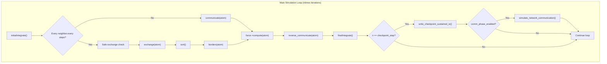

# 02_src/ — Source Code Directory

**Parent:** Repository Root  
**Purpose:** Contains the curated, production-ready source code for the miniMD DVFS optimization system.  
**Usage:** This directory holds the **final versions** of all source files. Do not modify shared-memory struct layouts without also updating the corresponding Python monitors.

---

## Directory Structure

```
02_src/
├── README.md                         (688 bytes)
├── comm_phase_version/               (empty — files in johnnie-comm-phase/)
├── mpi_comm_version/
│   ├── integrate.cpp                 (34,873 bytes · 1,136 lines)
│   └── integrate.h                   (1,533 bytes · 50 lines)
├── controllers/                      (empty — files in 07_archive/)
├── monitoring/
│   ├── monitoring.py                 (5,922 bytes · 189 lines)
│   ├── dashboard.py                  (11,248 bytes · 339 lines)
│   ├── bridge_to_dashboard.py        (3,462 bytes · 97 lines)
│   └── mon.py                        (5,363 bytes · 178 lines)
└── analysis/
    └── regenerate_all_plots_v4.py    (31,190 bytes)
```

---

## Subsystem: `mpi_comm_version/` — Instrumented miniMD Source

This is the **production C++ codebase** — the miniMD molecular dynamics proxy application with full instrumentation for phase-aware DVFS optimization.

### `integrate.h` — Class Declaration

| Attribute | Value |
|-----------|-------|
| Size | 1,533 bytes (50 lines) |
| Language | C++ |
| Class | `Integrate` |

#### Class Members

| Member | Type | Default | Purpose |
|--------|------|---------|---------|
| `dt` | `MMD_float` | — | Simulation timestep |
| `dtforce` | `MMD_float` | — | Force integration timestep (= `0.5 * dt`) |
| `ntimes` | `MMD_int` | — | Total number of simulation timesteps |
| `nlocal` | `MMD_int` | — | Number of local atoms on this MPI rank |
| `nmax` | `MMD_int` | — | Maximum atom array size |
| `x, v, f, xold` | `MMD_float*` | — | Position, velocity, force, and old-position arrays |
| `mass` | `MMD_float` | — | Atom mass |
| `sort_every` | `MMD_int` | `20` | Sort atom arrays every N steps |
| `ckpt_interval` | `MMD_int` | `0` | **DEPRECATED** — kept for compatibility |
| `ckpt_dir` | `const char*` | `"chk"` | Output directory for checkpoint files |
| `ckpt_at_end` | `MMD_int` | `1` | Perform checkpoint at end of simulation |
| `ckpt_io_duration_sec` | `double` | `30.0` | Target I/O duration in seconds |
| `ckpt_chunk_bytes` | `size_t` | `1 MB` | Bytes per chunk write |
| `ckpt_sleep_us` | `int` | `100000` | Sleep between chunks (µs) — 100ms default |
| `ckpt_fsync_chunks` | `int` | `0` | Whether to fsync after each chunk |
| `comm_phase_enabled` | `int` | `1` | Enable network communication phase |
| `comm_standin_bytes` | `size_t` | `309 MB` | Stand-in total bytes for communication |
| `comm_chunk_kb` | `int` | `1024` | MPI send/recv chunk size in KB |

#### Method Signatures

| Method | Signature | Purpose |
|--------|-----------|---------|
| `Integrate()` | Constructor | Initialize all defaults |
| `~Integrate()` | Destructor | Cleanup |
| `setup()` | `void setup()` | Compute `dtforce = 0.5 * dt / mass` |
| `initialIntegrate()` | `void initialIntegrate()` | Velocity-Verlet first half (v += F*dt/2; x += v*dt) |
| `finalIntegrate()` | `void finalIntegrate()` | Velocity-Verlet second half (v += F*dt/2) |
| `run()` | `void run(Atom&, Force*, Neighbor&, Comm&, Thermo&, Timer&)` | Main simulation loop |

---

### `integrate.cpp` — Core Implementation (1,136 lines)

#### Shared-Memory Phase Hint System (Lines 59–191)

##### `PhaseCode` Enum

| Code | Value | Meaning | Governor Action |
|------|-------|---------|-----------------|
| `PHASE_COMPUTE` | `0` | Force/neighbor computation | `performance` (max freq) |
| `PHASE_COMMUNICATE` | `1` | MPI halo exchange | `userspace` 1.6 GHz after 5ms |
| `PHASE_EXCHANGE` | `2` | Atom exchange | `userspace` 1.6 GHz after 5ms |
| `PHASE_BORDERS` | `3` | Border communication | `userspace` 1.6 GHz after 5ms |
| `PHASE_REVERSE` | `4` | Reverse communication | `userspace` 1.6 GHz after 5ms |
| `PHASE_IO` | `5` | Checkpoint I/O write | `userspace` 1.2 GHz after 2ms |
| `PHASE_SYNTH_ACTIVE` | `6` | Rank 0 MPI loopback | `userspace` 1.2 GHz after 2ms |
| `PHASE_SYNTH_WAIT` | `7` | Other ranks at barrier | `userspace` 1.2 GHz after 2ms |
| `PHASE_DONE` | `8` | Simulation complete | Cleanup |

##### `PhaseSlot` Struct (24 bytes)

```c
struct PhaseSlot {
    volatile uint32_t seq;    // Sequence number (seqlock protocol)
    volatile int32_t  rank;   // MPI rank index
    volatile int32_t  core;   // CPU core ID (from sched_getcpu())
    volatile uint32_t phase;  // Current PhaseCode
    volatile uint64_t t_ns;   // Monotonic timestamp (CLOCK_MONOTONIC)
};
```

##### `PhaseTable` Struct (Header + 64 slots)

```c
struct PhaseTable {
    uint32_t  magic;                    // 0x50485331 ("PHS1")
    uint32_t  nslots;                   // Number of active slots
    PhaseSlot slots[MAX_PHASE_SLOTS];   // Per-rank phase data (max 64)
};
```

##### Key Static Functions

| Function | Lines | Purpose |
|----------|-------|---------|
| `phase_hint_path()` | 102–105 | Returns `$PHASE_HINT_PATH` or default `/dev/shm/minimd_phase_hints.bin` |
| `monotonic_ns()` | 107–112 | Returns current `CLOCK_MONOTONIC` timestamp in nanoseconds |
| `phase_hint_write(phase)` | 114–131 | Writes phase to shared memory using seqlock (odd seq = write in progress, even = stable) |
| `phase_hint_init(me, nprocs)` | 133–172 | Rank 0 creates & initializes shared memory file; all ranks `mmap()` it |
| `phase_hint_fini(me)` | 174–191 | Writes `PHASE_DONE`, unmaps memory, Rank 0 unlinks file |

#### I/O Checkpoint System (Lines 193–509)

| Function | Lines | Purpose |
|----------|-------|---------|
| `clean_checkpoint_dir(dir)` | 199–248 | Rank 0 removes old checkpoint files (preserves symlinks) |
| `mkdir_rank0(dir)` | 251–268 | Rank 0 creates checkpoint directory |
| `write_checkpoint_sustained_io(...)` | 272–505 | Full sustained I/O checkpoint — writes real simulation data (positions, velocities, forces), then pads with synthetic data until `target_duration_sec` is reached |

**Checkpoint Data Layout (per rank):**
```
[CheckpointHeader: 96 bytes]
[positions: nlocal × 3 × sizeof(MMD_float)]
[velocities: nlocal × 3 × sizeof(MMD_float)]
[forces: nlocal × 3 × sizeof(MMD_float)]
[types: nlocal × sizeof(int)] (optional)
```

#### Communication Phase (Lines 511–685)

| Function | Lines | Purpose |
|----------|-------|---------|
| `calculate_per_rank_data_bytes(atom)` | 518–529 | Computes checkpoint-equivalent data size per rank |
| `simulate_network_communication(...)` | 531–681 | Rank 0 performs MPI loopback send/recv for `target_duration_sec`; other ranks wait at `MPI_Barrier` |

**Communication Data Size Formula:**
```
per_rank = header_bytes + (nlocal × 3 × sizeof(MMD_float) × 3) + (nlocal × sizeof(int))
         = 96 + nlocal × 76 bytes (when MMD_float = double, 8 bytes)
total    = per_rank × nprocs
```

#### Main Simulation Loop (`Integrate::run()`, Lines 729–end)



---

## Subsystem: `monitoring/` — Phase Monitoring and Dashboard Tools

### `monitoring.py` — I/O Detection Monitor (Gia)

| Attribute | Value |
|-----------|-------|
| Size | 5,922 bytes (189 lines) |
| Language | Python 3 |
| Author | Gia Lee |
| Method | `/proc/<pid>/io` wchar monitoring |
| Output | `storage_io_phaseA.csv` |

**Architecture:** Polls `/proc/<pid>/io` for all miniMD PIDs at 200ms intervals. Detects I/O phases when aggregate write throughput (`wchar`) exceeds 2 MB/s. Uses a state machine with `MIN_CHECKPOINT_DURATION_SEC = 30.0s` minimum to avoid premature phase exit during sleep intervals between chunk writes.

| Configuration | Value | Description |
|--------------|-------|-------------|
| `APP_PGREP_PATTERN` | `"miniMD_openmpi"` | Process name pattern |
| `SAMPLE_INTERVAL` | `0.2s` | Polling interval |
| `WCHAR_THRESHOLD_BPS` | `2 MB/s` | I/O detection threshold |
| `IGNORE_IO_FIRST_N_SEC` | `5.0s` | Startup noise filter |
| `MIN_CHECKPOINT_DURATION_SEC` | `30.0s` | Minimum I/O phase duration |

**CSV Output Schema:**
```
t_s, dt_s, ranks, wchar_MBps, phase, power_W
```

---

### `mon.py` — Phase-Aware Frequency Controller (Zane)

| Attribute | Value |
|-----------|-------|
| Size | 5,363 bytes (178 lines) |
| Language | Python 3 |
| Author | Zane Prance |
| Method | Shared-memory seqlock reader + cpufreq sysfs writer |
| IPC | Reads `PhaseTable` from `/dev/shm/minimd_phase_hints.bin` |

**Architecture:** The production-grade frequency controller. Reads phase hints from shared memory using the seqlock protocol, determines desired frequency policy based on phase type and age, then actuates via sysfs writes.

#### Frequency Policy Table

| Phase | Age Threshold | Action |
|-------|--------------|--------|
| `COMPUTE`, `SYNTH_ACTIVE`, `DONE` | Immediate | `performance` governor (max freq) |
| `IO`, `SYNTH_WAIT` | After `--low-after-ms` (default 2ms) | `userspace` @ `--freq-low` (1.2 GHz) |
| `COMMUNICATE`, `EXCHANGE`, `BORDERS`, `REVERSE` | After `--mid-after-ms` (default 5ms) | `userspace` @ `--freq-mid` (1.6 GHz) |

#### CLI Arguments

| Flag | Default | Description |
|------|---------|-------------|
| `--hint-file` | `$PHASE_HINT_PATH` or `/dev/shm/minimd_phase_hints.bin` | Shared memory path |
| `--freq-low` | `1200000` (1.2 GHz) | Frequency for I/O/wait phases |
| `--freq-mid` | `1600000` (1.6 GHz) | Frequency for MPI communication phases |
| `--poll-ms` | `2.0` | Polling interval in milliseconds |
| `--low-after-ms` | `2.0` | Age threshold for low-freq phases |
| `--mid-after-ms` | `5.0` | Age threshold for mid-freq phases |
| `--dry-run` | `false` | Print actions without actuating |

#### Key Functions

| Function | Purpose |
|----------|---------|
| `set_governor(core, gov)` | Write governor name to `/sys/devices/system/cpu/cpuN/cpufreq/scaling_governor` |
| `set_freq(core, freq)` | Write frequency to `scaling_setspeed` (only in `userspace` governor) |
| `apply_mode(core, mode, freq, cache)` | Cached apply — skips write if state unchanged |
| `snapshot_slot(slot)` | Seqlock reader — retries until sequence number is even and stable |
| `desired_policy(phase, age_ms, args)` | Maps (phase, age) → (governor, frequency) |

**Safety:** Skips cores 30 (monitor) and 31 (reserved). On `KeyboardInterrupt`, restores all seen cores to `performance` governor.

---

### `dashboard.py` — Live Terminal Dashboard (Zane)

| Attribute | Value |
|-----------|-------|
| Size | 11,248 bytes (339 lines) |
| Language | Python 3 |
| Author | Zane Prance |
| Framework | `curses` (terminal UI) |
| Input | Shared-memory phase hints + `/sys/devices/system/cpu/*/cpufreq/` |

**Architecture:** A real-time Terminal User Interface (TUI) that visualizes per-core frequencies, governor states, and application phase distributions. Designed to run in a separate tmux pane during experiments.

#### Dashboard Layout

```
┌──────────────────────────────────────────────────┐
│       miniMD PHASE-AWARE DVFS LIVE DASHBOARD      │
├──────┬──────┬──────┬──────┬──────┐                │
│ AVG  │ MIN/ │ LOW  │ PERF/│PHASE │  KPI boxes     │
│ MHz  │ MAX  │ FREQ │ USER │SLOTS │                │
├──────┴──────┴──────┴──────┴──────┘                │
│ ┌ Average Frequency Trend ─────────────────────┐  │
│ │ ▁▂▃▄▅▆▇█▇▆▅▄▃▂▁▂▃▄▅▆▇█  1800 MHz           │  │
│ └──────────────────────────────────────────────┘  │
│ ┌ Per-Core Frequency ────────┐ ┌ App Phases ──┐  │
│ │ cpu00 2000 P ████████████░ │ │ Phase totals │  │
│ │ cpu01 2000 P ████████████░ │ │ COMPUTE  16  │  │
│ │ cpu02 1200 U ██████░░░░░░░ │ │ IO        0  │  │
│ │ ...                        │ │              │  │
│ │ cpu29 1200 U ██████░░░░░░░ │ │ Rank → core  │  │
│ │ cpu30 2000 P ████████████░ │ │ rank 00→cpu04│  │
│ │ cpu31 2000 P ████████████░ │ │ rank 01→cpu05│  │
│ └────────────────────────────┘ └──────────────┘  │
└──────────────────────────────────────────────────┘
```

#### Visual Elements

| Element | Implementation |
|---------|---------------|
| Sparkline (`▁▂▃▄▅▆▇█`) | 120-sample sliding window of average MHz |
| Frequency bars (`████░░░░`) | Proportional fill against `MAX_MHZ = 3600` |
| Governor shorthand | `P` = performance, `U` = userspace |
| Color scheme | Red = <1400 MHz, Yellow = <2200 MHz, Green = ≥2200 MHz |

#### CLI Arguments

| Flag | Default | Description |
|------|---------|-------------|
| `--cores` | `32` | Number of CPU cores to display |
| `--refresh` | `0.5` | Refresh period in seconds |
| `--low-mark` | `1600.0` | Count frequencies below this as "throttled" |
| `--hint-file` | `$PHASE_HINT_PATH` | Shared memory path |

#### Keyboard Controls
- `q` / `Q` — Quit dashboard
- `r` / `R` — Reconnect to phase hint file

---

### `bridge_to_dashboard.py` — Text-to-Shared-Memory Bridge (Zane)

| Attribute | Value |
|-----------|-------|
| Size | 3,462 bytes (97 lines) |
| Language | Python 3 |
| Author | Zane Prance |
| Purpose | Translates text-based `phase_marker.txt` signals → shared-memory `PhaseTable` format |

**Architecture:** A compatibility layer. When the C++ application writes phase changes to `phase_marker.txt` (e.g., `"COMM_START"`, `"IO_END"`), this bridge reads the text file at 50ms intervals and writes the corresponding phase codes to the shared-memory hint file.

| Text Marker | → Phase Code |
|-------------|-------------|
| `"COMM_START"` | `PHASE_COMMUNICATE` (1) |
| `"IO_START"` | `PHASE_IO` (5) |
| `"COMM_END"`, `"IO_END"`, `"COMPUTE_RESUME"` | `PHASE_COMPUTE` (0) |
| `"DONE"` | `PHASE_DONE` (8) |

---

## Subsystem: `analysis/` — Data Processing

### `regenerate_all_plots_v4.py`

| Attribute | Value |
|-----------|-------|
| Size | 31,190 bytes |
| Language | Python 3 |
| Dependencies | `matplotlib`, `numpy` |
| Purpose | Reads raw experimental data and generates all publication-quality figures |
| Output | PNG files in `06_outputs/final_figures/` and `06_outputs/supplementary_plots/` |

---

## Subsystem: `comm_phase_version/` and `controllers/`

| Directory | Status | Note |
|-----------|--------|------|
| `comm_phase_version/` | **Empty** | C++ files reside in `johnnie-comm-phase/` and `07_archive/johnnie_comm_phase/` |
| `controllers/` | **Empty** | Controller scripts reside in `07_archive/johnnie_comm_phase/` (`comm_freq_controller.py`, `integrated_freq_controller.py`) |

These directories were created by `reorganize_workspace.ps1` but the source files may not have been present at the time of execution.
