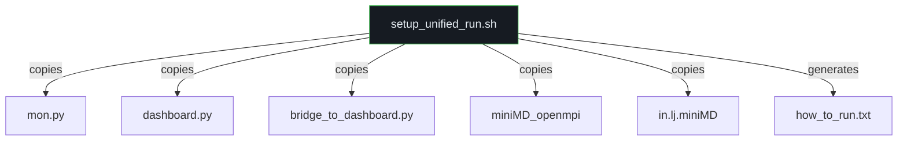

# 03_scripts/ — Scripts Directory

**Parent:** Repository Root  
**Purpose:** Manages the operational runtime and infrastructure of the project — executing the compiled application, controlling the CPU state, and orchestrating cluster jobs.  
**Usage:** Ensure that bash execution scripts and Python controllers point to the same shared-memory paths and magic numbers used in the compiled C++ code.

---

## Directory Structure

```
03_scripts/
├── README.md                         (808 bytes)
├── batch_tests/                      (empty — files in 07_archive/)
├── cluster_jobs/
│   └── setup_unified_run.sh          (2,406 bytes · 60 lines)
└── setup/                            (empty — placeholder)
```

---

## File-by-File Documentation

### `README.md`
| Attribute | Value |
|-----------|-------|
| Size | 808 bytes (12 lines) |
| Format | Markdown |
| Content | Describes the core Phase-Aware Python monitor, bash execution wrappers, and usage notes about shared-memory path alignment |

---

### `cluster_jobs/` Subdirectory

#### `setup_unified_run.sh`
| Attribute | Value |
|-----------|-------|
| Size | 2,406 bytes (60 lines) |
| Language | Bash |
| Author | Team (collaborative) |
| Purpose | Creates a portable `capstone_run/` directory with all files needed for a demo |
| Executable | Yes |

**Architecture:** A deployment automation script that aggregates files from multiple development branches into a single run-ready directory. It produces a self-contained folder that can be `scp`'d to the cluster.

**Files Assembled:**

| Source | Destination | Component |
|--------|-------------|-----------|
| `zane_mpi_comm/mpi_comm/mon.py` | `capstone_run/monitor.py` | Phase-aware frequency controller |
| `zane_mpi_comm/mpi_comm/dashboard.py` | `capstone_run/dvfs_dashboard.py` | Live TUI dashboard |
| `zane_mpi_comm/mpi_comm/bridge_to_dashboard.py` | `capstone_run/` | Text↔SHM bridge |
| `johnnie-comm-phase/miniMD_openmpi` | `capstone_run/` | Compiled miniMD binary |
| `johnnie-comm-phase/in.lj.miniMD` | `capstone_run/` | Simulation input deck |

**Generated File:** `capstone_run/how_to_run.txt` — A quick-start guide with 3-terminal instructions:
1. Terminal 1: Launch dashboard (`python3 dvfs_dashboard.py --cores 32`)
2. Terminal 2: Run MPI code (start bridge + `mpirun`)
3. Terminal 3: Optional manual controller (`python3 monitor.py`)

---

### `batch_tests/` Subdirectory

| Attribute | Value |
|-----------|-------|
| Status | **Empty** |
| Intended Contents | Parameterized batch test scripts for Tests A, B, C, D |
| Actual Location | Scripts remain in `07_archive/johnnie_comm_phase/` |

The following batch test scripts were defined in `reorganize_workspace.ps1` Phase 6 but may not have been copied if source paths didn't match:

| Script | Purpose | Est. Size |
|--------|---------|-----------|
| `batch_test_a.sh` | Test A: Baseline (no controller) | ~7 KB |
| `batch_test_b.sh` | Test B: Baseline with monitoring | ~8 KB |
| `batch_test_c.sh` | Test C: Simple frequency controller | ~9 KB |
| `batch_test_d.sh` | Test D: Extended test matrix | ~13 KB |
| `new_batch_test_a.sh` | Test A v2: Revised parameters | ~11 KB |
| `new_batch_test_b.sh` | Test B v2: Revised parameters | ~11 KB |
| `new_batch_test_c.sh` | Test C v2: Revised parameters | ~13 KB |
| `integrated_new_batch_test_a.sh` | Test A integrated: With full controller | ~11 KB |
| `integrated_new_batch_test_b.sh` | Test B integrated: With full controller | ~11 KB |
| `integrated_new_batch_test_c.sh` | Test C integrated: With full controller | ~13 KB |
| `automated_test_b.sh` | Automated Test B with error handling | ~5 KB |
| `run_freq_tests.sh` | Frequency sweep (1.2/1.6/2.0 GHz) | ~8 KB |

See [07_archive_branches.md](07_archive_branches.md) for full documentation of each script.

---

### `setup/` Subdirectory

| Attribute | Value |
|-----------|-------|
| Status | **Empty** |
| Intended Purpose | Environment setup scripts (venv creation, dependency installation, compiler flags) |
| Note | Created by `reorganize_workspace.ps1` Phase 1 but never populated |

---

## Dependency Map


