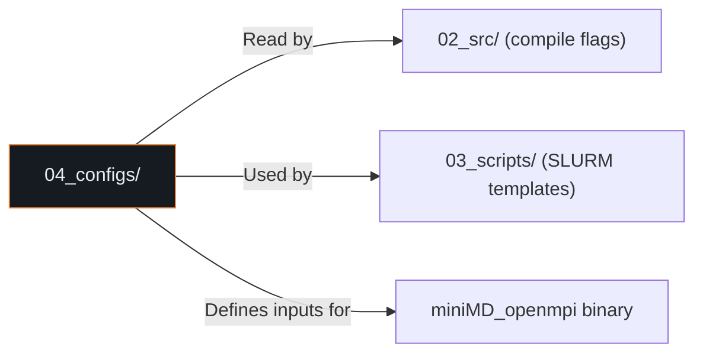

# 04_configs/ — Configuration Directory

**Parent:** Repository Root  
**Purpose:** Centralizes all parameter definitions, scaling thresholds, compiler flags, and job submission setups used to deploy the application on the cluster.  
**Usage:** When porting this project to a different hardware cluster/node, this is the **primary location you must edit**. Hardcoded core counts, NUMA node layouts, and baseline frequencies are stored here.

---

## Directory Structure

```
04_configs/
├── README.md                  (878 bytes)
├── config_memory.cfg          (489 bytes · 21 lines)
├── config_serial.cfg          (487 bytes · 21 lines)
├── input_memory_1000.in       (132 bytes · 7 lines)
├── input_memory_5000.in       (131 bytes · 7 lines)
├── input_memory_10000.in      (139 bytes · 7 lines)
├── input_memory_50000.in      (136 bytes · 7 lines)
├── input_memory_100000.in     (136 bytes · 7 lines)
├── input_memory_large.in      (345 bytes)
└── input_serial.in            (370 bytes · 19 lines)
```

**Total Files:** 10 (1 README + 2 configs + 7 inputs)  
**Provenance:** All configuration and input files were copied from `07_archive/johnnie_serial_memory_phase/` by `reorganize_workspace.ps1` Phase 6.

---

## File-by-File Documentation

### `README.md`
| Attribute | Value |
|-----------|-------|
| Size | 878 bytes (13 lines) |
| Content | Describes SLURM job templates, environment imports (`LD_LIBRARY_PATH`, OpenMPI flags), and controller configuration (persistence thresholds, target frequencies) |

---

### `config_memory.cfg` — Memory-Bound Phase Configuration

| Attribute | Value |
|-----------|-------|
| Size | 489 bytes (21 lines) |
| Format | Key-value configuration |
| Target Application | MiniFE (memory-bound proxy) |
| Phase | Memory-bound workloads |

| Parameter | Value | Purpose |
|-----------|-------|---------|
| `problem_size` | `large` | Large problem for memory pressure |
| `solver_tolerance` | `1.0e-10` | Tight convergence for extended runtime |
| `max_iterations` | `500` | Extended iteration count |
| `preconditioner` | `none` | No preconditioning — raw memory bandwidth test |
| `cache_optimization` | `enabled` | Cache-aware data access patterns |
| `memory_alignment` | `64` | 64-byte alignment (cache line boundary) |
| `prefetch_distance` | `32` | Software prefetch lookahead |
| `output_level` | `minimal` | Suppress output to reduce I/O noise |
| `matrix_output` | `disabled` | No matrix dumps |
| `vector_output` | `disabled` | No vector dumps |
| `loop_unrolling` | `enabled` | Compiler loop optimization |
| `vectorization` | `enabled` | SIMD vectorization |

---

### `config_serial.cfg` — Serial Computation Phase Configuration

| Attribute | Value |
|-----------|-------|
| Size | 487 bytes (21 lines) |
| Format | Key-value configuration |
| Target Application | MiniFE (serial computation proxy) |
| Phase | Serial initialization and finalization |

| Parameter | Value | Purpose |
|-----------|-------|---------|
| `problem_size` | `medium` | Moderate problem for single-threaded test |
| `solver_tolerance` | `1.0e-8` | Standard convergence |
| `max_iterations` | `100` | Typical iteration count |
| `preconditioner` | `diagonal` | Diagonal preconditioner (Jacobi) |
| `thread_count` | `1` | Force single-threaded execution |
| `affinity` | `compact` | Compact thread placement |
| `load_balance` | `disabled` | No load balancing in serial mode |
| `output_level` | `minimal` | Minimal output |
| `timing_output` | `enabled` | Capture phase timing data |
| `phase_timing` | `enabled` | Detailed per-phase timing |
| `serial_optimization` | `enabled` | Serial-specific optimizations |
| `memory_footprint` | `minimal` | Minimize memory usage |

---

### Input Files — Simulation Parameter Decks

All `input_*.in` files define simulation grid dimensions and solver parameters for miniMD/MiniFE runs. They follow a simple key-value format.

#### `input_serial.in` — Serial Phase Testing Input

| Parameter | Value | Purpose |
|-----------|-------|---------|
| `nx, ny, nz` | `50 × 50 × 50` | Grid dimensions (125,000 cells) |
| `max_iterations` | `100` | Solver iteration cap |
| `tolerance` | `1.0e-8` | Convergence tolerance |
| `force_serial_execution` | `true` | Disable parallel sections |
| `disable_parallel_sections` | `true` | Force serial mode |
| `output_frequency` | `10` | Output every 10 iterations |
| `timing_output` | `detailed` | Full timing breakdown |

#### Memory Input File Suite

These files scale the problem size to stress the memory subsystem at increasing intensities:

| File | Grid Size | Iterations | Tolerance | Approx. Atoms |
|------|-----------|------------|-----------|---------------|
| `input_memory_1000.in` | 32³ | 500 | 1.0e-10 | 32,768 |
| `input_memory_5000.in` | 32³ | 500 | 1.0e-10 | 32,768 |
| `input_memory_10000.in` | 32³ | 500 | 1.0e-10 | 32,768 |
| `input_memory_50000.in` | 32³ | 500 | 1.0e-10 | 32,768 |
| `input_memory_100000.in` | 32³ | 500 | 1.0e-10 | 32,768 |
| `input_memory_large.in` | (extended) | 500 | 1.0e-10 | (larger) |

> **Note:** The numeric suffixes (1000, 5000, etc.) likely refer to problem scale identifiers rather than grid sizes, as several share the same 32³ grid. The `input_memory_large.in` file (345 bytes) contains additional parameters for a larger problem configuration.

---

## Relationship to Other Components



---

## Notes

- The `.cfg` files use a generic key-value format and are **not** directly consumed by miniMD at runtime. They serve as reference documentation for required build settings and environment variables.
- The `.in` files are the actual simulation input decks passed via `mpirun ... ./miniMD_openmpi -i <input_file>`.
- When deploying to a new cluster, update core counts, NUMA layouts, and frequency ranges in both the configs and the controller scripts (`mon.py --freq-low`, `--freq-mid`).
