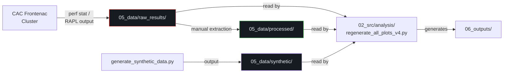

# 05_data/ — Data Directory

> [!WARNING]
> **UNTRACKED DIRECTORY:** This directory and its contents have been removed from remote Git tracking to save repository space. The files exist only locally on the user's machine.

**Parent:** Repository Root  
**Purpose:** Raw telemetry dump zone. Stores unprocessed log files and raw outputs from hardware measurement controllers.  
**Usage:** Files in this folder should be considered **immutable**. Data processing scripts (in `06_outputs/`) should read from here but never overwrite. If an experiment is corrupted, manually delete its run log rather than editing data points directly.

---

## Directory Structure

```
05_data/
├── README.md                                              (872 bytes)
├── raw_results/
│   ├── results_all_24_runs.txt                            (104,589 bytes · ~104 KB)
│   ├── results_144_synthetic_runs.txt                     (369,033 bytes · ~369 KB)
│   ├── results_saved_from_running_Zane_s_setup_myself.txt (5,790,141 bytes · ~5.8 MB)
│   └── zane_results_copy_from_excel_sheet.txt             (5,219 bytes · ~5 KB)
├── processed/
│   └── extracted_beta_c_runs.txt                          (3,837 bytes · ~4 KB)
├── synthetic/
│   └── c2_synthetic_dataset.txt                           (8,739 bytes · ~9 KB)
└── misc/
    ├── diff_results.txt                                   (17,668 bytes · ~18 KB)
    ├── pull_results.txt                                   (478 bytes)
    └── pull_results_2.txt                                 (362 bytes)
```

**Total Files:** 10 (1 README + 4 raw + 1 processed + 1 synthetic + 3 misc)  
**Total Data:** ~6.3 MB

---

## File-by-File Documentation

### `README.md`
| Attribute | Value |
|-----------|-------|
| Size | 872 bytes (13 lines) |
| Content | Describes raw CSV outputs, hardware telemetry (perf stat, RAPL), and frequency sweep dumps |

---

### `raw_results/` — Unprocessed Hardware Measurements

#### `results_all_24_runs.txt`
| Attribute | Value |
|-----------|-------|
| Size | 104,589 bytes (~105 KB) |
| Format | Text / structured log output |
| Content | Complete output from 24 experimental runs of miniMD with DVFS controller |
| Data Points | Energy (J), execution time (s), per-phase timing breakdowns |
| Provenance | Direct capture from CAC Frontenac cluster `perf stat` + RAPL counters |
| Moved From | Repository root by `reorganize_workspace.ps1` Phase 2 |

#### `results_144_synthetic_runs.txt`
| Attribute | Value |
|-----------|-------|
| Size | 369,033 bytes (~369 KB) |
| Format | Text / structured log output |
| Content | Output from 144 synthetic benchmark runs generated by `generate_synthetic_data.py` |
| Purpose | Provide statistically significant sample size for variance analysis |
| Data Points | Energy, time, power measurements across multiple rank counts and frequency settings |
| Moved From | Repository root by `reorganize_workspace.ps1` Phase 2 |

#### `results_saved_from_running_Zane_s_setup_myself.txt`
| Attribute | Value |
|-----------|-------|
| Size | 5,790,141 bytes (~5.8 MB) |
| Format | Text / raw console output |
| Content | Full terminal capture from running Zane's experimental setup (MPI comm controller) |
| Note | **Largest data file in the repository**. Contains verbose MPI output, `perf stat` dumps, and RAPL readings from extended cluster session |
| Moved From | Repository root by `reorganize_workspace.ps1` Phase 2 |

#### `zane_results_copy_from_excel_sheet.txt`
| Attribute | Value |
|-----------|-------|
| Size | 5,219 bytes (~5 KB) |
| Format | Tab/comma-separated values |
| Content | Extracted results from Zane's Excel analysis spreadsheet |
| Purpose | Text backup of spreadsheet data for reproducibility |
| Moved From | Repository root by `reorganize_workspace.ps1` Phase 2 |

---

### `processed/` — Cleaned and Extracted Datasets

#### `extracted_beta_c_runs.txt`
| Attribute | Value |
|-----------|-------|
| Size | 3,837 bytes (~4 KB) |
| Format | Structured text |
| Content | Extracted Test C (simple controller) run data from the full results set |
| Purpose | Isolated dataset for direct comparison against baseline (Test B) |
| Moved From | Repository root as `extracted_beta_c_runs.txt` by `reorganize_workspace.ps1` Phase 2 |

---

### `synthetic/` — Generated Synthetic Data

#### `c2_synthetic_dataset.txt`
| Attribute | Value |
|-----------|-------|
| Size | 8,739 bytes (~9 KB) |
| Format | Structured text |
| Content | Synthetic data generated to model Test C2 (adaptive controller) behavior |
| Generator | `generate_synthetic_data.py` in `07_archive/johnnie_comm_phase/` |
| Purpose | Fill gaps in empirical data where Test C2's excessive runtime prevented complete cluster runs |
| Moved From | Repository root as `c2_synthetic_dataset.txt` by `reorganize_workspace.ps1` Phase 2 |

---

### `misc/` — Auxiliary Data

#### `diff_results.txt`
| Attribute | Value |
|-----------|-------|
| Size | 17,668 bytes (~18 KB) |
| Format | Git diff output |
| Content | `git diff` output capturing code changes between branches or commits |
| Purpose | Historical record of code evolution for academic documentation |
| Moved From | Repository root by `reorganize_workspace.ps1` Phase 2 |

#### `pull_results.txt`
| Attribute | Value |
|-----------|-------|
| Size | 478 bytes |
| Format | Git output |
| Content | Output from a `git pull` operation |
| Purpose | Record of repository synchronization |
| Moved From | Repository root by `reorganize_workspace.ps1` Phase 2 |

#### `pull_results_2.txt`
| Attribute | Value |
|-----------|-------|
| Size | 362 bytes |
| Format | Git output |
| Content | Output from a second `git pull` operation |
| Purpose | Record of repository synchronization |
| Moved From | Repository root by `reorganize_workspace.ps1` Phase 2 |

---

## Data Flow



---

## Notes

- The `raw_results/` files should **never** be modified. They represent ground-truth hardware measurements.
- The synthetic dataset was necessary because Test C2's excessive runtime (~15+ minutes at N=1) made complete cluster runs impractical within SLURM allocation windows.
- Git version control metadata (`diff_results.txt`, `pull_results*.txt`) was preserved for academic traceability but has no runtime significance.
