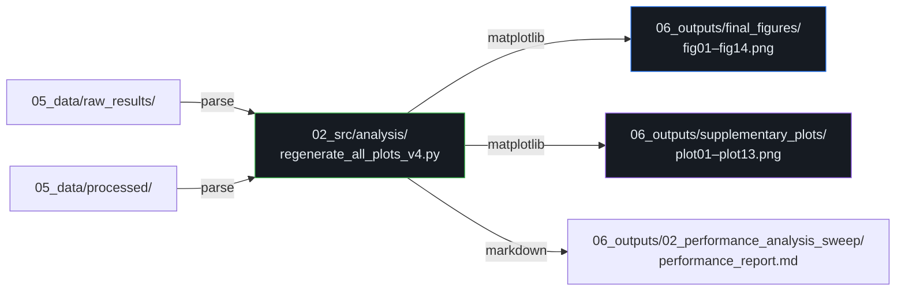

# 06_outputs/ — Outputs Directory

> [!WARNING]
> **UNTRACKED DIRECTORY:** This directory and its contents have been removed from remote Git tracking to save repository space. The files exist only locally on the user's machine.

**Parent:** Repository Root  
**Purpose:** Contains compiled analytics, data processing scripts, and final generated visual assets.  
**Usage:** This folder is fully reproducible. If you update plotting scripts, simply re-run them and new graphs will overwrite old ones.

---

## Directory Structure

```
06_outputs/
├── README.md                                        (857 bytes)
├── 02_performance_analysis_sweep/
│   ├── performance_report.md                        (2,387 bytes · 36 lines)
│   ├── execution_time_table.md                      (372 bytes · 12 lines)
│   └── figures/
│       ├── execution_time_scaling.png               (176,119 bytes)
│       └── frequency_speedup.png                    (164,031 bytes)
├── final_figures/
│   ├── fig01_energy_savings_compliance.png           (89,309 bytes)
│   ├── fig02_runtime_overhead_compliance.png         (80,293 bytes)
│   ├── fig03_energy_comparison.png                   (92,866 bytes)
│   ├── fig04_runtime_comparison.png                  (90,101 bytes)
│   ├── fig05_avg_power.png                           (138,417 bytes)
│   ├── fig06_design_iteration.png                    (137,325 bytes)
│   ├── fig07_energy_variability.png                  (86,344 bytes)
│   ├── fig08_energy_delay_product.png                (79,842 bytes)
│   ├── fig09_pareto_frontier.png                     (71,015 bytes)
│   ├── fig10_comprehensive_summary.png               (75,885 bytes)
│   ├── fig11_statistical_significance.png            (58,113 bytes)
│   ├── fig12_per_run_scatter.png                     (91,742 bytes)
│   ├── fig13_phase_policy_table.png                  (201,289 bytes)
│   └── fig14_spec_compliance.png                     (602,888 bytes)
└── supplementary_plots/
    ├── plot01_energy_comparison.png                   (77,646 bytes)
    ├── plot02_time_comparison.png                     (135,113 bytes)
    ├── plot03_perf_scaling.png                        (98,156 bytes)
    ├── plot03_perf_scaling_updated.png                (202,370 bytes)
    ├── plot04_avg_power.png                           (123,883 bytes)
    ├── plot05_energy_overhead.png                     (66,598 bytes)
    ├── plot06_time_overhead.png                       (58,056 bytes)
    ├── plot07_scaling_efficiency.png                  (106,878 bytes)
    ├── plot08_energy_variability.png                  (54,185 bytes)
    ├── plot10_energy_scaling.png                      (105,402 bytes)
    ├── plot11_energy_delay_product.png                (73,004 bytes)
    ├── plot12_pareto_curve.png                        (167,764 bytes)
    └── plot13_per_rank_comparison.png                 (64,545 bytes)
```

**Total Files:** 32 (1 README + 2 reports + 2 sweep figures + 14 final figures + 13 supplementary plots)  
**Total Size:** ~3.4 MB

---

## Subsystem: `02_performance_analysis_sweep/` — Frequency Scaling Study

### `performance_report.md`
| Attribute | Value |
|-----------|-------|
| Size | 2,387 bytes (36 lines) |
| Format | Markdown |
| Content | Comparative analysis of MiniMD execution times across 3 CPU frequencies (1.2, 1.6, 2.0 GHz) for 6 MPI rank counts (1, 2, 4, 8, 16, 30) |

**Key Findings:**
1. MiniMD is highly sensitive to CPU frequency at low rank counts (compute-dominated)
2. At N=30, I/O phases (~32s) constitute ~62% of runtime, diminishing frequency benefits
3. The communication phase itself is extremely short (~0.02s) — secondary optimization target

### `execution_time_table.md`
| Attribute | Value |
|-----------|-------|
| Size | 372 bytes (12 lines) |
| Format | Markdown table |
| Content | Execution time summary in seconds for all frequency × rank combinations |

| MPI Ranks | 1.2 GHz | 1.6 GHz | 2.0 GHz |
|-----------|---------|---------|---------|
| 1 | 801.4 | 612.2 | 498.7 |
| 2 | 420.5 | 325.1 | 267.9 |
| 4 | 224.8 | 177.4 | 149.0 |
| 8 | 129.1 | 105.3 | 91.0 |
| 16 | 90.5 | 76.3 | 67.8 |
| 30 | 64.0 | 56.3 | 51.7 |

### `figures/execution_time_scaling.png`
| Attribute | Value |
|-----------|-------|
| Size | 176,119 bytes (~176 KB) |
| Type | Line chart |
| Content | Strong scaling behavior of MiniMD at 1.2, 1.6, and 2.0 GHz |
| X-axis | MPI Rank Count |
| Y-axis | Execution Time (seconds) |

### `figures/frequency_speedup.png`
| Attribute | Value |
|-----------|-------|
| Size | 164,031 bytes (~164 KB) |
| Type | Line chart |
| Content | Speedup from increasing frequency, normalized against 1.2 GHz baseline |
| X-axis | MPI Rank Count |
| Y-axis | Speedup Factor |

---

## Subsystem: `final_figures/` — Publication-Quality Figures

These are the **primary figures** intended for the final capstone report and poster presentation. Generated by `regenerate_all_plots_v4.py`.

| Figure | File | Size | Content |
|--------|------|------|---------|
| **Fig 01** | `fig01_energy_savings_compliance.png` | 89 KB | Energy savings compliance against blueprint targets |
| **Fig 02** | `fig02_runtime_overhead_compliance.png` | 80 KB | Runtime overhead compliance (<3% target) |
| **Fig 03** | `fig03_energy_comparison.png` | 93 KB | Total energy (J) comparison across Tests B, C, C2 for all rank counts |
| **Fig 04** | `fig04_runtime_comparison.png` | 90 KB | Execution time comparison across Tests B, C, C2 |
| **Fig 05** | `fig05_avg_power.png` | 138 KB | Average power draw (W) vs MPI ranks with idle baseline |
| **Fig 06** | `fig06_design_iteration.png` | 137 KB | Design iteration history showing evolution from Test A → D |
| **Fig 07** | `fig07_energy_variability.png` | 86 KB | Box plots of energy measurement variability |
| **Fig 08** | `fig08_energy_delay_product.png` | 80 KB | Energy-Delay Product analysis (energy efficiency metric) |
| **Fig 09** | `fig09_pareto_frontier.png` | 71 KB | Power-Performance Pareto trade-off curve |
| **Fig 10** | `fig10_comprehensive_summary.png` | 76 KB | Multi-panel comprehensive summary dashboard |
| **Fig 11** | `fig11_statistical_significance.png` | 58 KB | Statistical significance analysis (p-values, confidence intervals) |
| **Fig 12** | `fig12_per_run_scatter.png` | 92 KB | Per-run scatter plot of individual trial results |
| **Fig 13** | `fig13_phase_policy_table.png` | 201 KB | Visual table of phase → governor policy mappings |
| **Fig 14** | `fig14_spec_compliance.png` | 603 KB | Comprehensive specification compliance matrix |

### Poster Recommendations (from `figure_captions_and_conclusions.md`)

| Priority | Figure | Rationale |
|----------|--------|-----------|
| 1st Pick | `fig03` (energy comparison) | "Hero" plot — directly answers the research question |
| 2nd Pick | `fig05` (energy overhead %) | Clearest "so what?" — single percentage per rank |
| 3rd Pick | `fig04` (runtime comparison) | Proves Test C is performance-neutral |

---

## Subsystem: `supplementary_plots/` — Supporting Visualizations

These plots provide deeper analytical views. Generated alongside the final figures.

| Plot | File | Size | Content |
|------|------|------|---------|
| **Plot 01** | `plot01_energy_comparison.png` | 78 KB | Energy comparison — grouped bar chart |
| **Plot 02** | `plot02_time_comparison.png` | 135 KB | Time comparison — line/bar chart |
| **Plot 03** | `plot03_perf_scaling.png` | 98 KB | Performance scaling (M atom-steps/s) vs ideal |
| **Plot 03u** | `plot03_perf_scaling_updated.png` | 202 KB | Updated version with refined data |
| **Plot 04** | `plot04_avg_power.png` | 124 KB | Average power vs ranks |
| **Plot 05** | `plot05_energy_overhead.png` | 67 KB | % energy change (C, C2 vs B) |
| **Plot 06** | `plot06_time_overhead.png` | 58 KB | % execution time change (C, C2 vs B) |
| **Plot 07** | `plot07_scaling_efficiency.png` | 107 KB | Strong scaling parallel efficiency (%) |
| **Plot 08** | `plot08_energy_variability.png` | 54 KB | Energy variability box plots |
| **Plot 10** | `plot10_energy_scaling.png` | 105 KB | Energy scaling line plots with error bars |
| **Plot 11** | `plot11_energy_delay_product.png` | 73 KB | Energy-delay product comparison |
| **Plot 12** | `plot12_pareto_curve.png` | 168 KB | Pareto frontier curve |
| **Plot 13** | `plot13_per_rank_comparison.png` | 65 KB | Per-rank comparison bars |

> **Note:** `plot09` is absent from the supplementary set (time breakdown is present only in the archive's `final_analysis/` directory).

---

## Generation Pipeline


