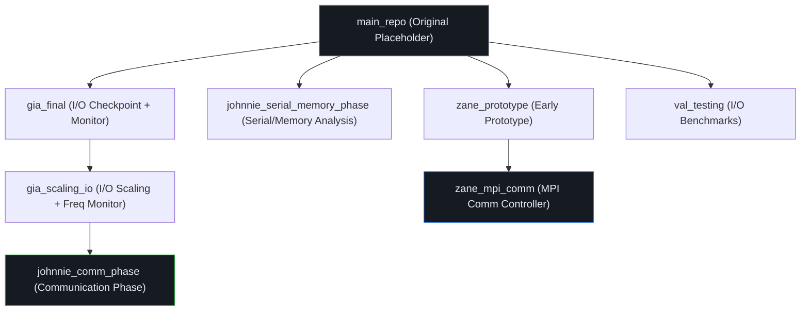
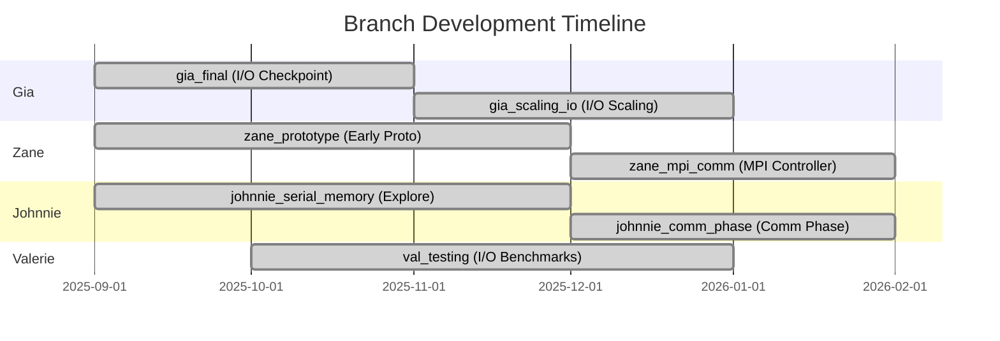

# 07_archive/ — Archived Development Branches

**Parent:** Repository Root  
**Purpose:** Contains deprecated prototypes, historical iterations, and original development branches abandoned during the design phase.  
**Usage:** Everything here is maintained strictly for **historical and academic validation purposes** — proving the iterative, evidence-driven design pivots documented in the final report. **Do not use scripts from this directory in the final operation pipeline.**

---

## Branch Overview

| Branch | Original Name | Files | Subdirs | Role | Owner |
|--------|--------------|-------|---------|------|-------|
| `johnnie_comm_phase` | `johnnie-comm-phase` | 38 | 7 | Primary: Communication phase + frequency controller | Johnnie |
| `johnnie_serial_memory_phase` | `johnnie-branch` | 29 | 1 | Serial/memory phase exploration + comm prototypes | Johnnie |
| `gia_final` | `gia-Final` | 7 | 0 | I/O checkpoint with monitoring script | Gia |
| `gia_scaling_io` | `gia-scaling-io` | 10 | 3 | I/O scaling with frequency monitoring | Gia |
| `zane_mpi_comm` | `zane_mpi_comm` | ~60+ | 8 | MPI communication controller (multiple iterations) | Zane |
| `zane_prototype` | `zane_prototype` | ~50+ | 7 | Early prototype (pre-MPI comm) | Zane |
| `val_testing` | `val_testing` | 29 | 0 | I/O benchmark automation suite | Valerie |
| `main_repo` | `elec-498-group-30-2025-2026-proxy-app` | 2 | 0 | Original repository placeholder | Team |

---

## Branch 1: `johnnie_comm_phase/` — Communication Phase Optimization

**Origin Branch:** `johnnie-comm-phase`  
**Owner:** Johnnie Tse  
**Status:** Primary development branch — contains the final production source code  
**Size:** 38 files + 7 subdirectories

### Root-Level Source Files

| File | Size | Language | Purpose |
|------|------|----------|---------|
| `integrate.cpp` | 31,566 bytes | C++ | miniMD integration with communication phase (Johnnie's version) |
| `integrate.h` | 1,531 bytes | C++ | Class declaration with comm phase fields |
| `ljs.cpp` | 22,299 bytes | C++ | miniMD main driver with `--comm_phase`, `--comm_standin_mb`, `--comm_chunk_kb` CLI flags |

### Frequency Controllers

| File | Size | Purpose | Viability |
|------|------|---------|-----------|
| `comm_freq_controller.py` | 10,813 bytes | **Test C** — Simple phase-detection controller. Lowers frequency to 1.2 GHz during I/O and comm phases | ✅ **Production-viable** (≤0.4% overhead) |
| `integrated_freq_controller.py` | 27,948 bytes | **Test C2** — Adaptive beta-adaptation controller. Attempts to infer phases from `t_comm` and `perf stat` | ❌ **Abandoned** (38–97% time regression) |

### Analysis & Visualization Scripts

| File | Size | Purpose |
|------|------|---------|
| `analyze_results.py` | 15,428 bytes | Parse raw results and generate summary statistics |
| `generate_synthetic_data.py` | 21,307 bytes | Generate synthetic run data for incomplete configurations |
| `filter_outliers.py` | 1,872 bytes | Remove statistical outliers from result sets |
| `verify_file_sizes.py` | 6,933 bytes | Verify checkpoint file sizes match expected per-rank calculations |

### Batch Test Scripts

| File | Size | Test | Description |
|------|------|------|-------------|
| `batch_test_a.sh` | 6,951 bytes | Test A | Baseline — no controller, raw miniMD |
| `batch_test_b.sh` | 7,721 bytes | Test B | Baseline with monitoring overhead |
| `batch_test_c.sh` | 9,159 bytes | Test C | Simple frequency controller active |
| `batch_test_d.sh` | 12,587 bytes | Test D | Extended test matrix |
| `new_batch_test_a.sh` | 10,974 bytes | Test A v2 | Revised parameters |
| `new_batch_test_b.sh` | 10,675 bytes | Test B v2 | Revised parameters |
| `new_batch_test_c.sh` | 12,656 bytes | Test C v2 | Revised parameters |
| `integrated_new_batch_test_a.sh` | 11,386 bytes | Integrated A | With full controller |
| `integrated_new_batch_test_b.sh` | 11,259 bytes | Integrated B | With full controller |
| `integrated_new_batch_test_c.sh` | 13,279 bytes | Integrated C | With full controller |
| `automated_test_b.sh` | 4,597 bytes | Auto B | Automated Test B with error handling |
| `run_freq_tests.sh` | 8,108 bytes | Freq sweep | Tests at 1.2/1.6/2.0 GHz |

### GUI / Dashboard Tools

| File | Size | Purpose |
|------|------|---------|
| `test_gui.py` | 10,177 bytes | TUI dashboard (curses) |
| `test_gui_web.py` | 16,651 bytes | Web-based dashboard (Flask) |
| `test_gui_windowed.py` | 7,734 bytes | Windowed GUI (Tkinter) |

### Documentation & Command References

| File | Size | Purpose |
|------|------|---------|
| `README.md` | 4,456 bytes | Comprehensive branch README (141 lines) |
| `ON_CLUSTER_TESTING_GUIDE.md` | 8,877 bytes | Step-by-step HPC cluster testing guide |
| `Manual_Commands_Guide.txt` | 20,433 bytes | Detailed manual command reference |
| `Commands_to_test_things_out.txt` | 3,295 bytes | Quick experiment commands |
| `b_commands.txt` | 1,642 bytes | Test B specific commands |
| `c_commands.txt` | 3,729 bytes | Test C specific commands |
| `c2_commands.txt` | 3,842 bytes | Test C2 specific commands |

### Data Files

| File | Size | Purpose |
|------|------|---------|
| `results_manual_test_b.csv` | 12,556 bytes | CSV results from manual Test B runs |
| `results_manual_test_c.csv` | 12,872 bytes | CSV results from manual Test C runs |
| `results_manual_test_c2.csv` | 12,974 bytes | CSV results from manual Test C2 runs |
| `book1_dump.csv` | 3,812 bytes | Raw data dump from Excel analysis |
| `Book1(Sheet1).xlsx` | 13,079 bytes | Analysis spreadsheet (Sheet 1 export) |
| `Book1.xlsx` | 31,380 bytes | Full analysis spreadsheet |
| `test_results_from_running_manual_commands_guide.txt` | 1,367,487 bytes (~1.4 MB) | Complete terminal output from manual testing |

### Graph Subdirectories

#### `energy_bar_graph/` (2 files)
| File | Size | Content |
|------|------|---------|
| `generate_energy_bar.py` | 5,798 bytes | Bar chart generation script |
| `energy_comparison_all_ranks.png` | 105,681 bytes | Energy comparison bar chart across all ranks |

#### `energy_comparison/` (2 files)
| File | Size | Content |
|------|------|---------|
| `generate_energy_comparison.py` | 5,266 bytes | Comparison chart script |
| `energy_comparison_all_ranks.png` | 86,066 bytes | Energy comparison chart |

#### `final_analysis/` (12 files)
| File | Size | Content |
|------|------|---------|
| `generate_all_plots.py` | 26,319 bytes | Comprehensive plot generator |
| `figure_captions_and_conclusions.md` | 6,166 bytes | Poster recommendations, captions, conclusions |
| `plot01_energy_comparison.png` | 88,499 bytes | Energy comparison |
| `plot02_time_comparison.png` | 103,793 bytes | Time comparison |
| `plot03_perf_scaling.png` | 105,016 bytes | Performance scaling |
| `plot04_avg_power.png` | 126,910 bytes | Average power |
| `plot05_energy_overhead.png` | 75,136 bytes | Energy overhead % |
| `plot06_time_overhead.png` | 97,975 bytes | Time overhead % |
| `plot07_scaling_efficiency.png` | 116,894 bytes | Scaling efficiency |
| `plot08_energy_variability.png` | 61,727 bytes | Energy variability |
| `plot09_time_breakdown.png` | 55,755 bytes | Time breakdown by component |
| `plot10_energy_scaling.png` | 124,020 bytes | Energy scaling |

#### `graphs/` (15 files)
Early-stage graphs generated during initial analysis iterations.

| File | Content |
|------|---------|
| `graph1_energy_comparison.png` | Energy comparison (v1) |
| `graph2_time_comparison.png` | Time comparison (v1) |
| `graph4_avg_power.png` | Average power (v1) |
| `graph8_comm_overhead.png` | Communication overhead |
| `graph9_controller_overhead.png` | Controller overhead |
| `graph8_9_overhead.png` | Combined overhead view |
| `graph10_performance.png` | Performance scaling |
| `graph11_energy_efficiency.png` | Energy efficiency |
| `graph14_time_breakdown.png` | Time breakdown |
| `graph15_dynamic_vs_idle.png` | Dynamic vs idle power |
| `graph16_phase_timeline.png` | Phase timeline |
| `graph_component_breakdown.png` | Component breakdown |
| `bonus_diagnosis.png` | Diagnostic analysis |
| `bonus_idle_power.png` | Idle power analysis |
| `bonus_test_a_n1_variability.png` | Test A N=1 variability |

#### `new_results/` (15 files)
Updated analysis with revised data. Contains `analyze_new_results.py` (26,125 bytes) and 14 graph PNGs.

#### `updated_graphs/` (15 files)
Final iteration graphs. Contains `generate_plots.py` (29,110 bytes) and 14 plot PNGs (plot01 through plot14).

#### `final_analysis_b_vs_c/` (14 files)
Direct B-vs-C comparison plots. Contains `generate_b_vs_c_plots.py`, `make_b_vs_c.py`, `extract_data.py`, `fix_c2_plots.py`, and 10 plot PNGs.

---

## Branch 2: `johnnie_serial_memory_phase/` — Serial/Memory Phase Exploration

**Origin Branch:** `johnnie-branch`  
**Owner:** Johnnie Tse  
**Status:** Exploratory — early work on serial and memory-bound phase detection  
**Size:** 29 files + 1 subdirectory

### Build Files

| File | Size | Purpose |
|------|------|---------|
| `Makefile` | 876 bytes | miniMD build configuration |
| `main.c` | 20 bytes | Placeholder C entry point |
| `.git` | 163 bytes | Git worktree link |

### Configuration Files (Copied to `04_configs/`)

| File | Purpose |
|------|---------|
| `config_memory.cfg` | Memory-bound phase config |
| `config_serial.cfg` | Serial phase config |
| `input_memory_*.in` (6 files) | Memory testing inputs at various scales |
| `input_serial.in` | Serial testing input |

### Analysis Scripts

| File | Size | Purpose |
|------|------|---------|
| `extract_memory_patterns.py` | 3,139 bytes | Extract memory access patterns from perf data |
| `extract_serial_phases.py` | 3,022 bytes | Extract serial phase timing from logs |
| `memory_analysis.py` | 8,710 bytes | Memory bandwidth and cache analysis |
| `memory_comprehensive_analysis.py` | 9,694 bytes | Extended memory analysis with NUMA awareness |
| `phase_analysis.py` | 2,347 bytes | Phase identification and classification |
| `serial_analysis.py` | 5,379 bytes | Serial phase performance analysis |
| `serial_optimization_report.py` | 6,177 bytes | Generate serial optimization report |
| `validate_serial_performance.py` | 7,386 bytes | Validate serial phase performance metrics |

### Cluster Scripts

| File | Size | Purpose |
|------|------|---------|
| `memory_bound_phase_test.sh` | 2,034 bytes | Local memory phase test |
| `memory_bound_phase_test_hpc.sh` | 9,336 bytes | HPC cluster memory phase test |
| `serial_computation_phase_test.sh` | 2,282 bytes | Serial computation test |
| `setup_test_environment.sh` | 1,246 bytes | Local environment setup |
| `setup_test_environment_hpc.sh` | 1,862 bytes | HPC environment setup |
| `verify_setup.sh` | 1,527 bytes | Verify environment configuration |
| `submit_test_job.sbatch` | 579 bytes | SLURM batch submission |
| `test_commands.txt` | 376 bytes | Quick test commands |

### `Testing_for_communication/` Subdirectory (9 files)

Communication phase prototypes developed before the final `johnnie_comm_phase` branch.

| File | Size | Purpose |
|------|------|---------|
| `communication_monitor.py` | 10,975 bytes | Early communication phase monitor |
| `comm_v7_monitor.py` | 29,783 bytes | Version 7 of communication monitor |
| `comm_v8_monitor.py` | 32,933 bytes | Version 8 — improved accuracy |
| `v12_comm_monitor.py` | 40,743 bytes | Version 12 — extensive monitoring |
| `v13_comm_monitor.py` | 51,292 bytes | Version 13 — near-final monitor |
| `another_more_valid_monitoring_script.py` | 15,708 bytes | Alternative monitoring approach |
| `latest_most_recent_best_result_script_for_miniMD_comm_monitoring.py` | 67,352 bytes | Final "best" monitoring script |
| `commands_for_latest_most_recent_best_result_script_for_miniMD_comm_monitoring.txt` | 872 bytes | Commands for the best script |

#### `Testing_for_communication/optimized_trial/` (1 file)
| File | Size | Purpose |
|------|------|---------|
| `optimized_run_for_comm_phase_trial_1.py` | 72,721 bytes | Optimized trial run script (~73 KB — largest Python script in repo) |

---

## Branch 3: `gia_final/` — I/O Checkpoint with Monitoring

**Origin Branch:** `gia-Final`  
**Owner:** Gia Lee  
**Status:** Stable — I/O checkpoint implementation with monitoring  
**Size:** 7 files

| File | Size | Purpose |
|------|------|---------|
| `README.md` | 1,071 bytes | Usage instructions (salloc, mpirun, checkpoint verification) |
| `integrate.cpp` | 19,776 bytes | miniMD with I/O checkpoint (Gia's version) |
| `integrate.h` | 1,123 bytes | Class declaration |
| `ljs.cpp` | 19,033 bytes | Main driver with `--ckpt` flag |
| `monitoring.py` | 5,922 bytes | I/O phase detection via `/proc/<pid>/io` |
| `main.c` | 20 bytes | Placeholder |
| `.git` | 158 bytes | Git worktree link |

---

## Branch 4: `gia_scaling_io/` — I/O Scaling with Frequency Monitoring

**Origin Branch:** `gia-scaling-io`  
**Owner:** Gia Lee  
**Status:** Exploratory — extended I/O with frequency-based monitoring  
**Size:** 10 files + 3 subdirectories

### Root Files

| File | Size | Purpose |
|------|------|---------|
| `README.md` | 903 bytes | Setup instructions for Johnnie |
| `integrate.cpp` | 24,239 bytes | Extended integrate with I/O scaling |
| `integrate.h` | 1,285 bytes | Class declaration |
| `ljs.cpp` | 19,620 bytes | Main driver |
| `frequency_included_monitoring_script.py` | 11,782 bytes | Monitoring with frequency tracking |
| `monitoring_fixed.py` | 6,995 bytes | Fixed version of monitoring script |
| `checkpoint_freq_full.sh` | 19,896 bytes | Full frequency checkpoint test |
| `checkpoint_step00000000_rank00000.bin` | **316 MB** | **Binary checkpoint file** (in `.gitignore`) |
| `main.c` | 20 bytes | Placeholder |
| `.git` | 163 bytes | Git worktree link |

### Subdirectories

#### `io_exclusinve/` (5 files — note: typo "exclusinve" in original)
| File | Size | Purpose |
|------|------|---------|
| `integrate.cpp` | 16,797 bytes | I/O exclusive version |
| `checkpoint_freq_full.sh` | 20,538 bytes | Full checkpoint freq test |
| `final.sh` | 21,662 bytes | Final test script |
| `updated.sh` | 21,930 bytes | Updated script |
| `withoutfile.sh` | 21,739 bytes | Test without file I/O |

#### `optomization/` (2 files — note: typo "optomization" in original)
| File | Size | Purpose |
|------|------|---------|
| `integrate.cpp` | 24,626 bytes | Optimized integrate |
| `ljs2.cpp` | 20,148 bytes | Modified main driver |

#### `results/` (2 subdirectories)
| Directory | Content |
|-----------|---------|
| `32x32x32_problem_size_workload/` | Results for 32³ grid |
| `64x64x64_problem_size_workload/` | Results for 64³ grid |

---

## Branch 5: `zane_mpi_comm/` — MPI Communication Controller

**Origin Branch:** `zane_mpi_comm`  
**Owner:** Zane Prance  
**Status:** Core development — contains the production monitor, dashboard, and launch scripts  
**Size:** ~60+ files across 8 subdirectories

### `mpi_comm/` (9 files) — **Production-Ready Components**

| File | Size | Purpose |
|------|------|---------|
| `integrate.cpp` | 34,873 bytes | **Final** integrate with shared-memory hints (same as `02_src/mpi_comm_version/`) |
| `integrate.h` | 1,533 bytes | Final class declaration |
| `dashboard.py` | 13,765 bytes | Production TUI dashboard (extended version) |
| `mon.py` | 5,363 bytes | Production frequency controller |
| `bridge_to_dashboard.py` | 3,462 bytes | Text → shared-memory bridge |
| `launch_demo.sh` | 1,993 bytes | tmux 3-pane demo launcher |
| `cleanup.sh` | 579 bytes | Governor restoration script |
| `test.sh` | 7,413 bytes | Test execution script |
| `how_to_run_dashboartd.txt` | 763 bytes | 3-terminal run guide (note: typo in filename) |

### `legacy/` (10 files) — Early Prototypes

| File | Size | Purpose |
|------|------|---------|
| `integrate.cpp` | 7,913 bytes | Early integrate prototype |
| `integrate2.cpp` | 7,091 bytes | Second iteration |
| `tune_integrate.cpp` | 8,270 bytes | Tuned version |
| `probe_and_pin_to_core.py` | 7,103 bytes | Core probing and pinning utility |
| `team21.py` | 468 bytes | Team 21 reference script |
| `test.py` | 6,869 bytes | Test harness |
| `tuner.py` | 8,739 bytes | Frequency tuning script |
| `v_17_final_mon_merger.py` | 29,135 bytes | Version 17 monitor (merged) |
| `v_18_improving_accuracy.py` | 35,700 bytes | Version 18 (accuracy improvements) |
| `validate_acc.py` | 4,184 bytes | Accuracy validation |

### `Baseline_02_08/` (4 files) — Feb 8 Baseline Measurements

| File | Purpose |
|------|---------|
| `base_integrate.cpp` | Baseline integrate (no modifications) |
| `base_integrate.h` | Baseline header |
| `base_monitor.py` | Baseline monitoring script |
| `base_overhead.sh` | Baseline overhead measurement |

### `Experiment_02_08/` (8 files) — Feb 8 Experiment Data

| File | Purpose |
|------|---------|
| `experiment_monitor.py` | Experimental monitor |
| `experiment_overhead.sh` | Overhead measurement script |
| `use_this_monitor.py` | Recommended monitor version |
| `use_this_validate.sh` | Recommended validation script |
| `betacode.py` | Beta-adaptation algorithm |
| `checking.py` | Result verification |
| `ohgod.py` | Debugging script (emergency) |
| `new.sh` | Updated test script |

### `JOHNNY_TEST/` (6 files) — Cross-Team Validation

| File | Size | Purpose |
|------|------|---------|
| `john_integrate.cpp` | 27,957 bytes | Johnnie's integrate modifications |
| `john_integarte.h` | 1,529 bytes | Johnnie's header (note: typo in filename) |
| `john_mon.py` | 11,452 bytes | Johnnie's monitor variant |
| `john_test2.py` | 26,836 bytes | Extended test script |
| `johnny_val.sh` | 10,899 bytes | Validation script |
| `johnny_val2.sh` | 8,226 bytes | Second validation |

### `Testing/` (2 subdirectories)

#### `Testing/New_Test/` (6 files)
| File | Purpose |
|------|---------|
| `automate.sh` | Automation shell script |
| `baseline.py` | Baseline measurement |
| `task.py` | Task management script |
| `task2_experiment.py` | Experiment task runner |
| `zaner.py` | Zane's runner script |
| `zaner.sh` | Zane's shell runner |

#### `Testing/flags/` (7 files)
| File | Purpose |
|------|---------|
| `gia_and_me_integrate.cpp` | Combined Gia + Zane integrate |
| `integrate.h` | Header for flags version |
| `hint_fluff.py` | Phase hint padding script |
| `hint_trim.py` | Phase hint trimming |
| `monitor_with_flags_v19.py` | Version 19 monitor with flag support |
| `overhead_check.sh` | Overhead checking script |
| `val.py` | Validation script |

### `tryingC/` (3 files)
| File | Size | Purpose |
|------|------|---------|
| `integrate.cpp` | 27,959 bytes | "Trying C" version of integrate |
| `test.py` | 25,496 bytes | Test script |
| `c_val.sh` | 8,846 bytes | C validation script |

### `.vscode/` (1 file)
| File | Content |
|------|---------|
| `tasks.json` | VS Code task configuration for build automation |

---

## Branch 6: `zane_prototype/` — Early Prototype

**Origin Branch:** `zane_prototype`  
**Owner:** Zane Prance  
**Status:** Deprecated — pre-MPI-comm prototype  
**Size:** ~50+ files across 7 subdirectories

Mirrors `zane_mpi_comm` structure but **without** the `mpi_comm/` subdirectory. Contains the same `Baseline_02_08/`, `Experiment_02_08/`, `JOHNNY_TEST/`, `Testing/`, `legacy/`, and `tryingC/` directories at earlier stages of development.

---

## Branch 7: `val_testing/` — I/O Benchmark Suite

**Origin Branch:** `val_testing`  
**Owner:** Valerie So  
**Status:** Complete — I/O benchmark automation  
**Size:** 29 files

### Automation Scripts

| File | Size | Purpose |
|------|------|---------|
| `automate_baseline.sh` | 1,914 bytes | Basic baseline automation |
| `automate_baseline_1_cores.sh` | 2,249 bytes | 1-core baseline |
| `automate_baseline_2_cores.sh` | 2,252 bytes | 2-core baseline |
| `automate_baseline_4_cores.sh` | 2,265 bytes | 4-core baseline |
| `automate_baseline_8_cores.sh` | 2,253 bytes | 8-core baseline |
| `automate_baseline_16_cores.sh` | 2,258 bytes | 16-core baseline |
| `automate_baseline_32_cores.sh` | 2,258 bytes | 32-core baseline |
| `automate_scaling.sh` | 3,486 bytes | Multi-scale automation |

### SLURM Submission Scripts

| File | Size | Purpose |
|------|------|---------|
| `submit.sh` | 622 bytes | Basic submission |
| `submit_automation.sh` | 663 bytes | Automated submission |
| `submit_automation_1_cores.sh` | 984 bytes | 1-core job |
| `submit_automation_2_cores.sh` | 985 bytes | 2-core job |
| `submit_automation_4_cores.sh` | 985 bytes | 4-core job |
| `submit_automation_8_cores.sh` | 985 bytes | 8-core job |
| `submit_automation_16_cores.sh` | 989 bytes | 16-core job |
| `submit_automation_32_cores.sh` | 989 bytes | 32-core job |
| `submit_scaling.sh` | 1,417 bytes | Scaling job submission |

### Analysis & Visualization

| File | Size | Purpose |
|------|------|---------|
| `test.py` | 4,377 bytes | Basic test analysis |
| `test_io.py` | 3,870 bytes | I/O-specific test analysis |
| `output_io.py` | 1,959 bytes | I/O output formatting |
| `working_test.py` | 5,410 bytes | Validated working test |
| `measure_energy.sh` | 1,640 bytes | Energy measurement wrapper |

### Data & Results

| File | Size | Purpose |
|------|------|---------|
| `benchmark_results.csv` | 1,012 bytes | Benchmark results dataset |
| `io_benchmark_boxplots.png` | 58,605 bytes | Box plot visualization |

### miniMD Input Decks

| File | Content |
|------|---------|
| `miniMD lennard test simulation.txt` | Lennard-Jones test parameters |
| `miniMD_light_load.txt` | Light load configuration |
| `miniMD_max_load.txt` | Maximum load configuration |
| `miniMD_strong_load.txt` | Strong load configuration |

---

## Branch 8: `main_repo/` — Original Repository Placeholder

**Origin Branch:** `elec-498-group-30-2025-2026-proxy-app`  
**Owner:** Team  
**Status:** Placeholder — initial repository state  
**Size:** 2 files

| File | Size | Content |
|------|------|---------|
| `README.md` | 54 bytes | `"elec-498-group-30-2025-2026-proxy-app"` |
| `main.c` | 20 bytes | Empty C file |

---

## Evolution Timeline

---

## Key Observations

1. **Code matured through 18+ monitor versions** — from `v_17_final_mon_merger.py` through `monitor_with_flags_v19.py` before settling on the final `mon.py`
2. **The "betacode" algorithm was abandoned** — `betacode.py` and `ohgod.py` in `Experiment_02_08/` represent the moment the team realized the adaptive approach was fundamentally flawed
3. **Cross-team validation was critical** — `JOHNNY_TEST/` contains Johnnie's modifications to Zane's code, proving collaborative verification
4. **The 316 MB checkpoint binary** in `gia_scaling_io/` is the largest file in the repository and should never be committed to Git
