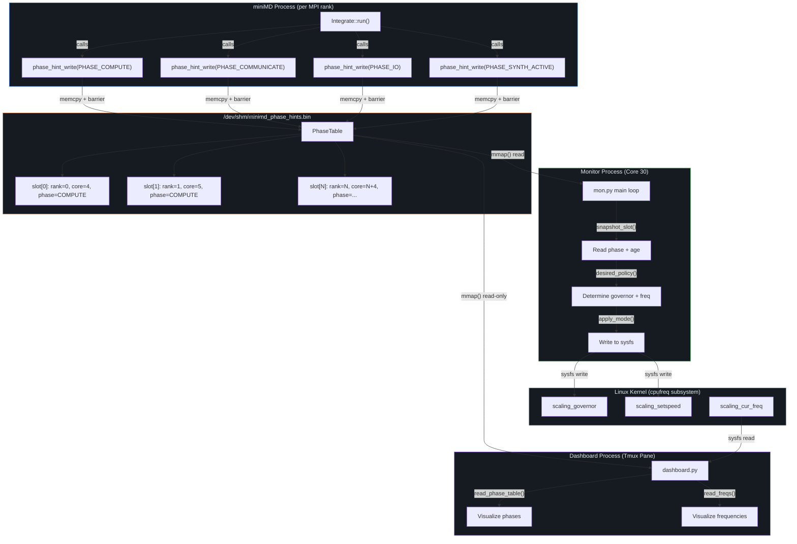
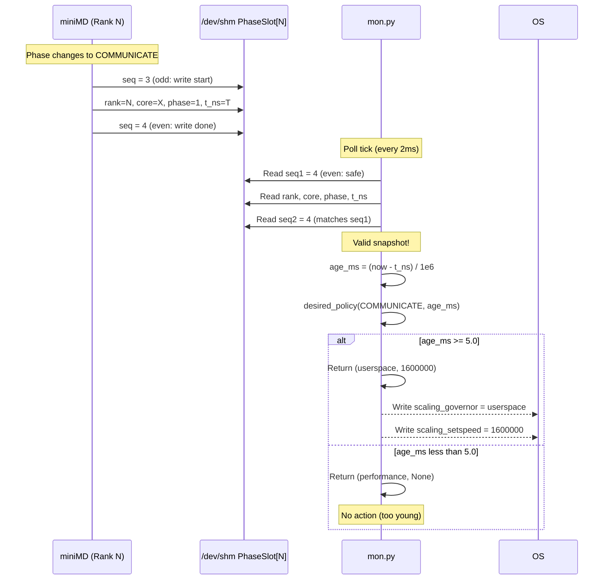
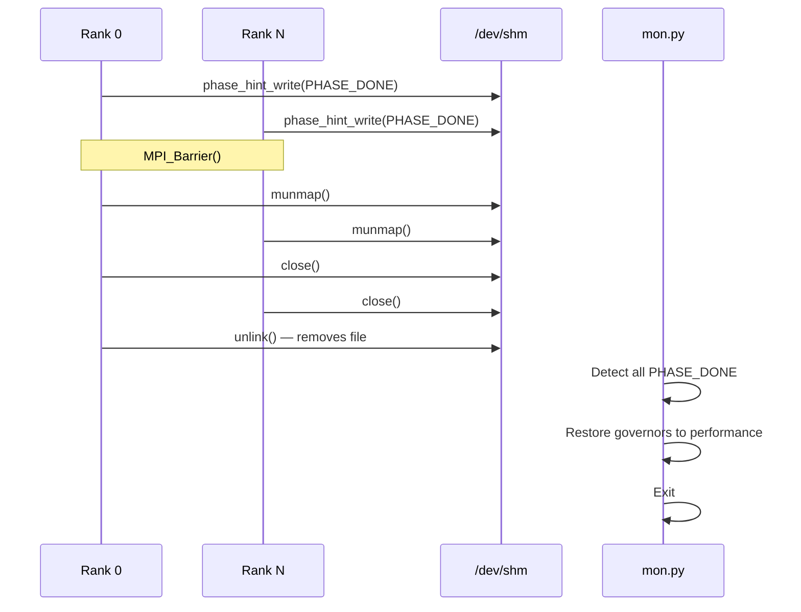

# 09_data_flow_and_ipc.md — Data Flow and Inter-Process Communication

**Scope:** Cross-cutting concern documentation covering the shared-memory IPC protocol, data flow from application → monitor → actuator, and the seqlock synchronization mechanism.

---

## 1. System Data Flow Overview



---

## 2. POSIX Shared Memory Protocol Specification

### 2.1 File Location

| Property | Value |
|----------|-------|
| Default Path | `/dev/shm/minimd_phase_hints.bin` |
| Environment Override | `$PHASE_HINT_PATH` |
| File Permissions | `0666` (world readable/writable) |
| Creator | MPI Rank 0 (`phase_hint_init()`) |
| Cleanup | MPI Rank 0 (`phase_hint_fini()` → `unlink()`) |

### 2.2 Memory Layout

```
Offset  Size    Field              Description
─────────────────────────────────────────────────────────
0x0000  4 bytes  magic             Magic number: 0x50485331 ("PHS1")
0x0004  4 bytes  nslots            Number of active phase slots
0x0008  24 bytes slot[0]           PhaseSlot for rank 0
0x0020  24 bytes slot[1]           PhaseSlot for rank 1
...
0x0008 + i*24    slot[i]           PhaseSlot for rank i
...
0x0608  24 bytes slot[63]          PhaseSlot for rank 63 (max)
─────────────────────────────────────────────────────────
Total: 8 + 64 × 24 = 1,544 bytes
```

### 2.3 PhaseSlot Layout (24 bytes per slot)

```
Offset  Size    Field    Type               Description
──────────────────────────────────────────────────────────
+0x00   4 bytes  seq     volatile uint32_t  Sequence counter (seqlock)
+0x04   4 bytes  rank    volatile int32_t   MPI rank index
+0x08   4 bytes  core    volatile int32_t   CPU core ID (sched_getcpu())
+0x0C   4 bytes  phase   volatile uint32_t  PhaseCode enum value
+0x10   8 bytes  t_ns    volatile uint64_t  CLOCK_MONOTONIC timestamp (ns)
──────────────────────────────────────────────────────────
```

---

## 3. Seqlock Synchronization Protocol

The system uses a **lock-free sequence lock** protocol to ensure readers always get a consistent snapshot of phase data without blocking writers.

### 3.1 Writer Protocol (C++ — `phase_hint_write()`)

```
1. seq = slot.seq + 1          // Increment to ODD (write in progress)
2. __sync_synchronize()        // Full memory barrier
3. Write: rank, core, phase, t_ns
4. __sync_synchronize()        // Full memory barrier
5. slot.seq = seq + 1          // Increment to EVEN (write complete)
```

**Key Invariant:** An **odd** sequence number means a write is in progress; an **even** sequence number means the data is stable.

### 3.2 Reader Protocol (Python — `snapshot_slot()`)

```python
while True:
    seq1 = slot.seq
    if seq1 & 1:               # Odd = write in progress
        continue               # Spin-wait
    rank  = slot.rank
    core  = slot.core
    phase = slot.phase
    t_ns  = slot.t_ns
    seq2  = slot.seq
    if seq1 == seq2:           # No writer interrupted
        return (rank, core, phase, t_ns)
    # Else: writer changed data during read — retry
```

### 3.3 Timing Characteristics

| Metric | Value |
|--------|-------|
| Write latency | ~0.001ms (memcpy + 2 barriers) |
| Read latency | ~0.001ms (4 field reads + 2 seq checks) |
| Contention probability | Near-zero (writers are once per phase transition, readers poll at 2ms) |
| Maximum stale read | 1 poll interval (2ms default) |

### 3.4 Sequence Diagram



---

## 4. Phase Lifecycle

### 4.1 Initialization Flow

```mermaid
sequenceDiagram
    participant R0 as Rank 0
    participant SHM as /dev/shm
    participant RN as Rank N
    participant Mon as mon.py

    R0->>SHM: open(O_CREAT | O_RDWR | O_TRUNC)
    R0->>SHM: ftruncate(sizeof(PhaseTable))
    R0->>SHM: mmap(PROT_READ|PROT_WRITE, MAP_SHARED)
    R0->>SHM: memset(0); magic=0x50485331; nslots=N
    R0->>SHM: msync(MS_SYNC)
    R0->>SHM: munmap(); close()
    
    Note over R0,RN: MPI_Barrier()
    
    R0->>SHM: open(O_RDWR); mmap()
    RN->>SHM: open(O_RDWR); mmap()
    R0->>SHM: phase_hint_write(PHASE_COMPUTE)
    RN->>SHM: phase_hint_write(PHASE_COMPUTE)
    
    Mon->>SHM: Wait for file existence
    Mon->>SHM: open(); mmap(ACCESS_WRITE)
    Mon->>SHM: Wait for magic == 0x50485331
    Note over Mon: Attached and monitoring
```

### 4.2 Teardown Flow



---

## 5. Alternative IPC: Text-Based Phase Markers

For backward compatibility or simplified deployments, a text-based alternative exists:

### `phase_marker.txt` Protocol

| Marker Text | Meaning |
|-------------|---------|
| `"IO_START"` | I/O phase begins |
| `"IO_END"` | I/O phase ends |
| `"COMM_START <bytes>"` | Communication phase begins |
| `"COMM_END"` | Communication phase ends |
| `"COMPUTE_RESUME"` | Compute phase resumes |
| `"DONE"` | Simulation complete |

### Bridge Architecture


**Tradeoff:** Text markers add ~50ms latency per phase transition vs. ~0.001ms for direct shared-memory writes. Suitable for demos but not production benchmarking.

---

## 6. `/proc/<pid>/io` Based Detection (Alternative)

`monitoring.py` (Gia) uses a completely different approach — instead of application-published phase hints, it monitors each MPI rank's write throughput via Linux's `/proc/<pid>/io` pseudo-filesystem.

| Method | Shared Memory (Zane/Johnnie) | /proc/io Monitoring (Gia) |
|--------|-----------------------------|---------------------------|
| Accuracy | High (application-level hints) | Medium (heuristic threshold) |
| Latency | ~0.001ms | ~200ms (poll interval) |
| Coupling | Requires C++ instrumentation | Zero-change to application |
| Phases Detected | All 9 phases | 2 phases (COMPUTE, CHECKPOINT_IO) |
| Suitability | Production | Rapid prototyping |
