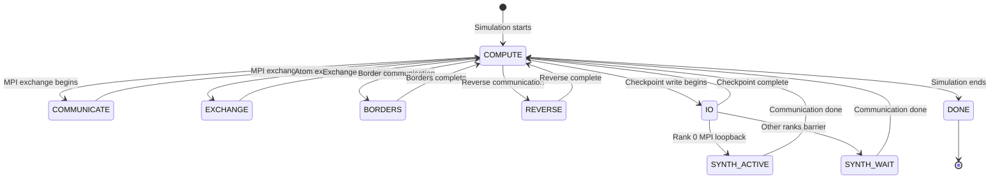
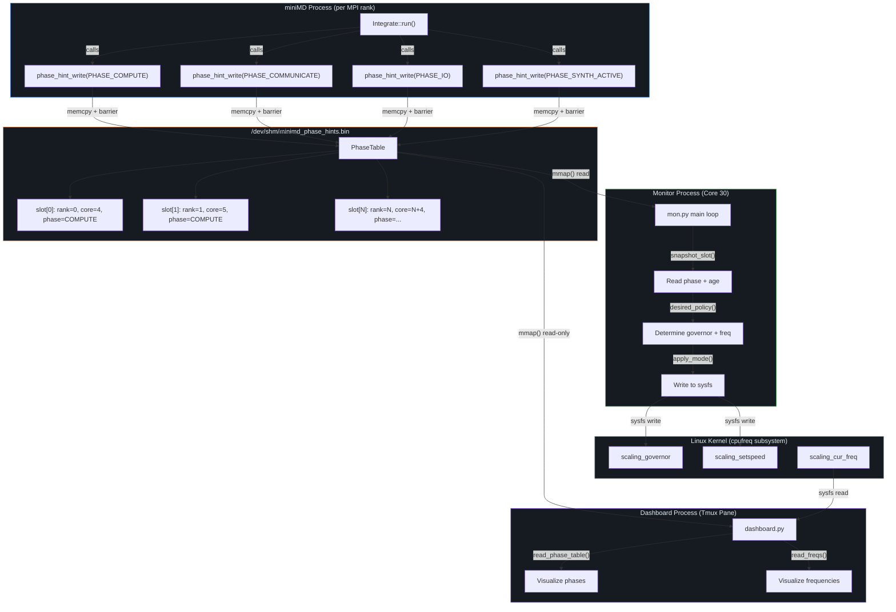
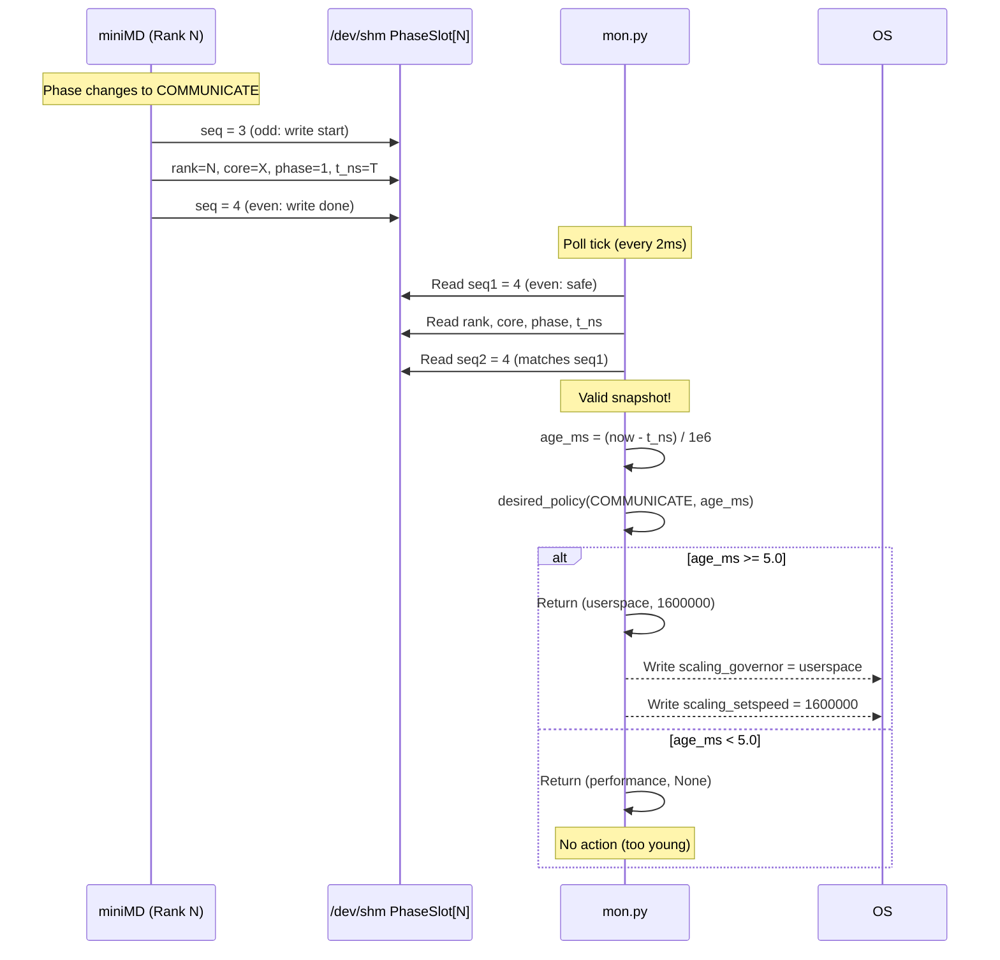
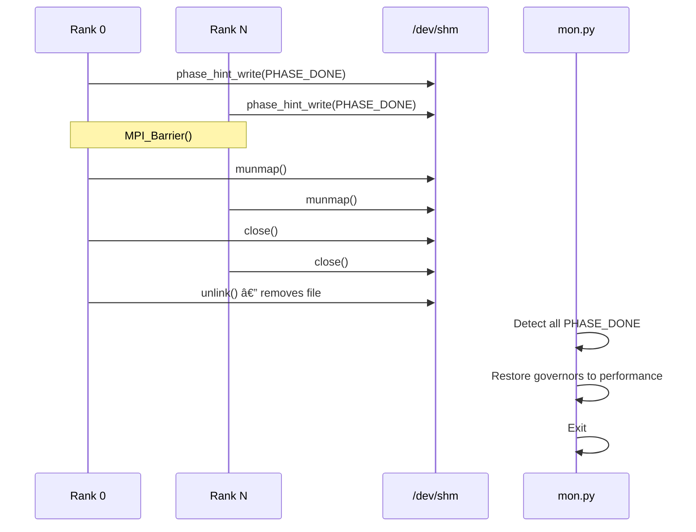
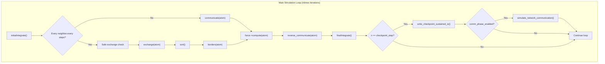
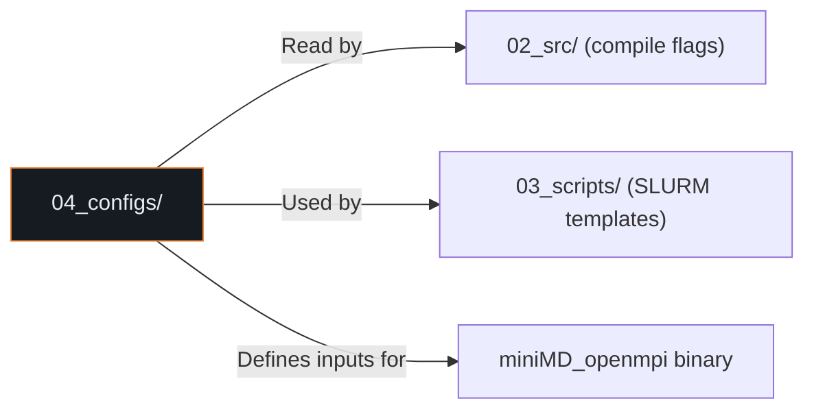
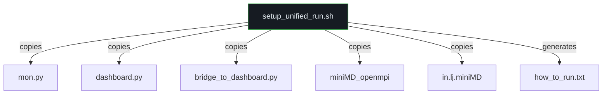

# MASTER_ARCHITECTURE.md — Comprehensive Technical Documentation


> This document is automatically compiled from the 00_architecture_docs directory. It serves as the single source of truth for all technical implementation details, IPC protocols, execution workflows, and diagrams for the miniMD Phase-Aware DVFS Optimization project.

---


# System Architecture Document

**Project:** miniMD Phase-Aware DVFS Optimization  
**Course:** ELEC 490/498 Capstone — Group 30  
**Authors:** Johnnie Tse, Gia Lee, Zane Prance, Valerie So  
**Supervisor:** Dr. Ryan Grant  
**Platform:** CAC Frontenac HPC Cluster (AMD EPYC 7551P, 32 cores)  
**Last Updated:** 2026-04-22  

---

## 1. Executive Summary

This system implements a **user-level, phase-aware Dynamic Voltage and Frequency Scaling (DVFS) controller** for the miniMD molecular dynamics proxy application from the Mantevo project. The controller detects application execution phases in real-time through a shared-memory IPC mechanism and dynamically adjusts CPU core frequencies to reduce energy consumption during low-utilization phases (I/O, communication, synchronization waits) while maintaining full performance during compute-intensive phases.

The architecture follows a **three-tier decoupled design**:

1. **Instrumented Application** (C++ / MPI) — Publishes phase hints to POSIX shared memory
2. **Frequency Controller** (Python) — Reads phase hints and actuates CPU `cpufreq` governors
3. **Observability Layer** (Python / curses) — Optional real-time TUI dashboard for live monitoring

---

## 2. Architecture Diagram

```mermaid
flowchart TB
    subgraph HPC_Node["CAC Frontenac Node (AMD EPYC 7551P · 32 Cores)"]
        direction TB
        
        subgraph AppLayer["Application Layer (Cores 0–N)"]
            miniMD["miniMD_openmpi<br/>(C++ / MPI)"]
            IO["I/O Checkpoint<br/>Phase (Gia)"]
            COMM["Communication<br/>Phase (Johnnie)"]
            miniMD --> IO --> COMM
        end

        subgraph IPCLayer["IPC Layer (/dev/shm)"]
            SHM["/dev/shm/minimd_phase_hints.bin<br/>(PhaseTable · Lock-Free Seqlock)"]
        end

        subgraph ControlLayer["Control Layer (Core 30)"]
            MON["mon.py<br/>Phase Monitor +<br/>Frequency Controller"]
        end

        subgraph KernelLayer["Kernel Interface"]
            SYSFS["/sys/devices/system/cpu/cpuN/cpufreq/<br/>scaling_governor · scaling_setspeed"]
            RAPL["/sys/class/powercap/intel-rapl/<br/>energy_uj (RAPL Counters)"]
        end

        subgraph ObsLayer["Observability Layer (Tmux Pane)"]
            DASH["dashboard.py<br/>(curses TUI)"]
        end

        miniMD -->|"phase_hint_write()"| SHM
        SHM -->|"mmap() read"| MON
        SHM -->|"mmap() read"| DASH
        MON -->|"sysfs write"| SYSFS
        MON -->|"sysfs read"| RAPL
    end

    subgraph Reserved["Core 31 · RESERVED"]
        HPC_MAINT["HPC System<br/>Maintenance"]
    end

    style HPC_Node fill:#0d1117,stroke:#30363d,color:#e6edf3
    style AppLayer fill:#161b22,stroke:#1f6feb,color:#e6edf3
    style IPCLayer fill:#161b22,stroke:#f0883e,color:#e6edf3
    style ControlLayer fill:#161b22,stroke:#3fb950,color:#e6edf3
    style KernelLayer fill:#161b22,stroke:#8b949e,color:#e6edf3
    style ObsLayer fill:#161b22,stroke:#a371f7,color:#e6edf3
    style Reserved fill:#161b22,stroke:#f85149,color:#e6edf3
```



---

## 3. Core Layout (32-Core Node)

| Core(s) | Role | Process | Changeable? |
|---------|------|---------|-------------|
| `0 – N` | Worker Cores | MPI ranks (1:1 core binding) | ✅ Frequency controlled |
| `30` | Monitor Core | `mon.py` / `comm_freq_controller.py` | ❌ Pinned to `performance` |
| `31` | Reserved | HPC system maintenance | ❌ No permission to modify |

**Valid Worker Counts:** 1, 2, 4, 8, 16, 26, 30  
- Maximum: 30 cores (core 30 = monitor, core 31 = reserved)  
- Maximum power-of-2: 16 cores  
- Typical demo: 26 cores (`taskset -c 4-29`)

---

## 4. Technology Stack

| Layer | Technology | Version / Details |
|-------|------------|-------------------|
| Application | C++ (miniMD from Mantevo) | Modified `integrate.cpp`, `ljs.cpp` |
| Parallelism | OpenMPI | `mpirun` with `--bind-to core --map-by core` |
| IPC | POSIX Shared Memory | `/dev/shm/minimd_phase_hints.bin` via `mmap()` |
| Controller | Python 3 | `mon.py`, `comm_freq_controller.py` |
| Actuation | Linux cpufreq sysfs | `scaling_governor`, `scaling_setspeed` |
| Telemetry | Intel RAPL | `energy_uj` via `/sys/class/powercap/` |
| Dashboard | Python curses | Terminal User Interface (TUI) |
| Job Scheduler | SLURM | `salloc`, `sbatch` on Frontenac cluster |
| Build System | GNU Make | `make openmpi -j 8` |
| Session Manager | tmux | Multi-pane demo launcher (`launch_demo.sh`) |

---

## 5. Component Interaction Model

### 5.1 Phase Lifecycle State Machine



### 5.2 Execution Timeline

```
┌─────────────┬────────────────────────────┬──────────────────────┬────────────────────────────┬─────────────┐
│  COMPUTE    │        I/O PHASE           │    COMM PHASE        │        COMPUTE             │    DONE     │
│  (Force +   │  (Sustained checkpoint     │  (MPI loopback on    │  (Second half of           │             │
│   Neighbor) │   writes, ~30s target)     │   rank 0, ~30s)      │   simulation loop)         │             │
├─────────────┼────────────────────────────┼──────────────────────┼────────────────────────────┼─────────────┤
│  2.0 GHz    │  1.2 GHz (DVFS active)     │  1.2 GHz (DVFS)      │  2.0 GHz (restored)        │  Cleanup    │
│  performance│  userspace governor        │  userspace governor   │  performance governor      │             │
└─────────────┴────────────────────────────┴──────────────────────┴────────────────────────────┴─────────────┘
```

---

## 6. Design Decisions (Architecture Decision Records)

### ADR-001: Lock-Free Seqlock for Phase Communication
- **Context:** The C++ application must communicate phase state to the Python monitor with <1ms latency
- **Decision:** Use a lock-free sequence-lock protocol via POSIX shared memory (`/dev/shm`)
- **Rationale:** Avoids mutex contention, zero-copy, near-zero overhead. The seqlock pattern ensures readers always get a consistent snapshot without blocking writers
- **Consequences:** Reader must retry on odd sequence numbers; monitor must tolerate stale reads

### ADR-002: Dedicated Monitor Core
- **Context:** The monitor must not compete with application MPI ranks for CPU time
- **Decision:** Pin the monitor to Core 30 using `taskset -c 30`
- **Rationale:** Core 30 is the second-to-last core, leaving Core 31 for HPC system maintenance. This guarantees zero contention between the monitor and the application
- **Consequences:** Reduces available worker cores by 1 (from 31 to 30 max)

### ADR-003: Simple Phase Controller (Test C) over Adaptive Controller (Test C2)
- **Context:** Two controller designs were evaluated — a simple threshold-based controller and an adaptive beta-adaptation controller
- **Decision:** Adopt the simple `comm_freq_controller.py` (Test C) as the production controller
- **Rationale:** Test C2 (`integrated_freq_controller.py`) caused 38–97% execution time regressions due to slow frequency ramp-up after I/O phases. Test C maintains ≤0.4% overhead
- **Consequences:** Simpler code, predictable behavior, modest but reliable energy savings

### ADR-004: Sustained I/O and Communication Phases
- **Context:** Original miniMD has no I/O or communication phases — they needed to be synthesized for research
- **Decision:** Inject sustained I/O (Gia) and MPI loopback communication (Johnnie) phases into the simulation loop
- **Rationale:** Real HPC applications have substantial communication and I/O phases; miniMD alone is nearly purely compute-bound. The synthesis creates a realistic multi-phase workload
- **Consequences:** Phases are configurable via CLI flags (`--comm_phase`, `--comm_standin_mb`, `--ckpt_ioscale_sec`)

### ADR-005: File-Based Phase Markers as Bridge Fallback
- **Context:** The shared-memory protocol requires both C++ and Python to agree on struct layouts
- **Decision:** Provide `bridge_to_dashboard.py` as a fallback that reads text-based `phase_marker.txt` and writes to shared memory
- **Rationale:** Enables the dashboard to work even when the application uses text-based phase signaling
- **Consequences:** Adds latency (~50ms poll) but provides compatibility

---

## 7. Repository Structure Overview

```
ELEC_498_All_directories_and_branches_folder_for_2026_02_15/
├── 00_architecture_docs/    [NEW] Software architecture documentation
├── 01_docs/                 Formal reports, guides, and reference materials
│   ├── reports/             Final capstone reports (ELEC 490 Reports 1 & 2)
│   └── guides/              Testing guides and command references
├── 02_src/                  Production source code (curated final versions)
│   ├── comm_phase_version/  C++ source with communication phase (Johnnie)
│   ├── mpi_comm_version/    C++ source with MPI comm + shared-memory hints (Zane)
│   ├── controllers/         Python frequency controllers
│   ├── monitoring/          Phase monitoring and dashboard tools
│   └── analysis/            Data analysis and plot generation scripts
├── 03_scripts/              Operational runtime scripts
│   ├── batch_tests/         Parameterized batch test scripts (Tests A–D)
│   ├── cluster_jobs/        SLURM job submission and environment setup
│   └── setup/               Environment setup scripts (placeholder)
├── 04_configs/              Configuration files and simulation inputs
├── 05_data/                 Telemetry dumps and experimental results
│   ├── raw_results/         Unprocessed hardware measurement logs
│   ├── processed/           Extracted and cleaned datasets
│   ├── synthetic/           Generated synthetic datasets
│   └── misc/                Git diffs, pull results
├── 06_outputs/              Analytics, figures, and generated reports
│   ├── 02_performance_analysis_sweep/  Frequency scaling study
│   ├── final_figures/       Publication-quality figures (fig01–fig14)
│   └── supplementary_plots/ Supporting visualizations (plot01–plot13)
├── 07_archive/              Deprecated prototypes and historical branches
│   ├── johnnie_comm_phase/  Communication phase optimization (primary)
│   ├── johnnie_serial_memory_phase/  Serial/memory phase exploration
│   ├── gia_final/           I/O checkpoint with monitoring
│   ├── gia_scaling_io/      I/O scaling with frequency monitoring
│   ├── zane_mpi_comm/       MPI communication controller (multiple iterations)
│   ├── zane_prototype/      Early prototype (pre-MPI comm)
│   ├── val_testing/         I/O benchmark automation suite
│   └── main_repo/           Original repository placeholder
├── 08_test_gui/             TUI/web/windowed dashboard experiments
├── johnnie-comm-phase/      Active development branch (comm phase source)
├── README.md                Project overview
├── .gitignore               Version control exclusions
├── reorganize_workspace.ps1 7-phase workspace migration script
├── large_files.txt          Registry of files exceeding Git's size limit
└── push_log.txt             Git push operation logs
```

---

## 8. Team Responsibility Matrix

| Team Member | Phase | Key Contributions |
|-------------|-------|-------------------|
| **Johnnie Tse** | Communication Phase | `integrate.cpp` comm phase injection, `comm_freq_controller.py`, batch tests, data analysis, workspace reorganization |
| **Gia Lee** | I/O (Storage) Phase | `integrate.cpp` sustained I/O checkpoint, `monitoring.py`, per-rank scaling |
| **Zane Prance** | MPI Communication | `mon.py` phase-aware controller, `dashboard.py` TUI, shared-memory protocol, `bridge_to_dashboard.py`, beta-adaptation algorithm |
| **Valerie So** | I/O Benchmarking | `val_testing/` benchmark suite, multi-core I/O scaling scripts, baseline measurements |

---

## 9. Security and Access Model

| Resource | Access Level | Notes |
|----------|-------------|-------|
| `/dev/shm/minimd_phase_hints.bin` | `0666` (world r/w) | Created by Rank 0, cleaned up on termination via `unlink()` |
| `/sys/devices/system/cpu/cpuN/cpufreq/*` | Root or `cpufreq` group | Requires `sudo` or group membership on Frontenac |
| `/sys/class/powercap/intel-rapl/*/energy_uj` | Readable by default | RAPL energy counters — read-only telemetry |
| Core 31 | System-reserved | HPC scheduler owns this core; **never modify** |
| `cleanup.sh` | Emergency restore | Restores all governors to `performance` — run after crashes |

---

## 10. Performance Characteristics

| Metric | Target | Achieved |
|--------|--------|----------|
| Phase hint write latency | <1ms | ~0.001ms (direct `memcpy` + barrier) |
| Monitor poll interval | 2ms | 2ms (`--poll-ms 2`) |
| Frequency actuation latency | <1ms | <1ms (direct sysfs write) |
| Controller CPU overhead | <5% | 0.04% (0.04ms per 100ms loop) |
| Execution time overhead (Test C) | <3% | ≤0.4% |
| Energy savings (Test C, N=30) | 10–15% | ~2.4% (limited by I/O sleep pattern) |
| RAPL measurement variance | — | 10–20% σ (requires 25+ trials for significance) |

---

## 11. Failure Modes and Recovery

| Failure | Impact | Recovery |
|---------|--------|----------|
| Monitor crashes mid-actuation | Worker cores stuck in `userspace` governor at low frequency | Run `cleanup.sh` to restore all governors to `performance` |
| Shared memory file missing | Monitor waits indefinitely; dashboard shows "Waiting for hint file" | Restart miniMD (Rank 0 creates the file) |
| RAPL counter overflow | Energy values wrap around (16-bit µJ counter) | Correct with modular arithmetic; occurs at ~80 minutes of continuous measurement |
| MPI rank crash | Application exits; shared memory orphaned | `unlink()` called by Rank 0 on normal exit; manual `rm /dev/shm/*.bin` otherwise |
| Tmux session collision | `launch_demo.sh` kills existing `minimd_demo` session | By design — script runs `tmux kill-session` first |

---

## 12. Cross-References

| Document | Coverage |
|----------|----------|
| [02_src_directory.md](02_src_directory.md) | Source code deep-dive, class hierarchy, API reference |
| [03_scripts_directory.md](03_scripts_directory.md) | Batch test scripts and cluster job automation |
| [04_configs_directory.md](04_configs_directory.md) | Configuration files and simulation parameters |
| [05_data_directory.md](05_data_directory.md) | Raw telemetry, processed data, synthetic datasets |
| [06_outputs_directory.md](06_outputs_directory.md) | Performance reports, figures, supplementary plots |
| [07_archive_branches.md](07_archive_branches.md) | All 8 archived development branches |
| [08_test_gui_directory.md](08_test_gui_directory.md) | Dashboard implementations |
| [09_data_flow_and_ipc.md](09_data_flow_and_ipc.md) | Shared-memory protocol specification |
| [10_build_deploy_runbook.md](10_build_deploy_runbook.md) | Build, deploy, and operational procedures |
| [11_root_level_files.md](11_root_level_files.md) | Root-level file documentation |
| [12_glossary_and_references.md](12_glossary_and_references.md) | Terminology and external references |


---


# 09_data_flow_and_ipc.md — Data Flow and Inter-Process Communication

**Scope:** Cross-cutting concern documentation covering the shared-memory IPC protocol, data flow from application → monitor → actuator, and the seqlock synchronization mechanism.

---

## 1. System Data Flow Overview



---

## 2. POSIX Shared Memory Protocol Specification

### 2.1 File Location

| Property | Value |
|----------|-------|
| Default Path | `/dev/shm/minimd_phase_hints.bin` |
| Environment Override | `$PHASE_HINT_PATH` |
| File Permissions | `0666` (world readable/writable) |
| Creator | MPI Rank 0 (`phase_hint_init()`) |
| Cleanup | MPI Rank 0 (`phase_hint_fini()` → `unlink()`) |

### 2.2 Memory Layout

```
Offset  Size    Field              Description
─────────────────────────────────────────────────────────
0x0000  4 bytes  magic             Magic number: 0x50485331 ("PHS1")
0x0004  4 bytes  nslots            Number of active phase slots
0x0008  24 bytes slot[0]           PhaseSlot for rank 0
0x0020  24 bytes slot[1]           PhaseSlot for rank 1
...
0x0008 + i*24    slot[i]           PhaseSlot for rank i
...
0x0608  24 bytes slot[63]          PhaseSlot for rank 63 (max)
─────────────────────────────────────────────────────────
Total: 8 + 64 × 24 = 1,544 bytes
```

### 2.3 PhaseSlot Layout (24 bytes per slot)

```
Offset  Size    Field    Type               Description
──────────────────────────────────────────────────────────
+0x00   4 bytes  seq     volatile uint32_t  Sequence counter (seqlock)
+0x04   4 bytes  rank    volatile int32_t   MPI rank index
+0x08   4 bytes  core    volatile int32_t   CPU core ID (sched_getcpu())
+0x0C   4 bytes  phase   volatile uint32_t  PhaseCode enum value
+0x10   8 bytes  t_ns    volatile uint64_t  CLOCK_MONOTONIC timestamp (ns)
──────────────────────────────────────────────────────────
```

---

## 3. Seqlock Synchronization Protocol

The system uses a **lock-free sequence lock** protocol to ensure readers always get a consistent snapshot of phase data without blocking writers.

### 3.1 Writer Protocol (C++ — `phase_hint_write()`)

```
1. seq = slot.seq + 1          // Increment to ODD (write in progress)
2. __sync_synchronize()        // Full memory barrier
3. Write: rank, core, phase, t_ns
4. __sync_synchronize()        // Full memory barrier
5. slot.seq = seq + 1          // Increment to EVEN (write complete)
```

**Key Invariant:** An **odd** sequence number means a write is in progress; an **even** sequence number means the data is stable.

### 3.2 Reader Protocol (Python — `snapshot_slot()`)

```python
while True:
    seq1 = slot.seq
    if seq1 & 1:               # Odd = write in progress
        continue               # Spin-wait
    rank  = slot.rank
    core  = slot.core
    phase = slot.phase
    t_ns  = slot.t_ns
    seq2  = slot.seq
    if seq1 == seq2:           # No writer interrupted
        return (rank, core, phase, t_ns)
    # Else: writer changed data during read — retry
```

### 3.3 Timing Characteristics

| Metric | Value |
|--------|-------|
| Write latency | ~0.001ms (memcpy + 2 barriers) |
| Read latency | ~0.001ms (4 field reads + 2 seq checks) |
| Contention probability | Near-zero (writers are once per phase transition, readers poll at 2ms) |
| Maximum stale read | 1 poll interval (2ms default) |

### 3.4 Sequence Diagram



---

## 4. Phase Lifecycle

### 4.1 Initialization Flow

```mermaid
sequenceDiagram
    participant R0 as Rank 0
    participant SHM as /dev/shm
    participant RN as Rank N
    participant Mon as mon.py

    R0->>SHM: open(O_CREAT | O_RDWR | O_TRUNC)
    R0->>SHM: ftruncate(sizeof(PhaseTable))
    R0->>SHM: mmap(PROT_READ|PROT_WRITE, MAP_SHARED)
    R0->>SHM: memset(0); magic=0x50485331; nslots=N
    R0->>SHM: msync(MS_SYNC)
    R0->>SHM: munmap(); close()
    
    Note over R0,RN: MPI_Barrier()
    
    R0->>SHM: open(O_RDWR); mmap()
    RN->>SHM: open(O_RDWR); mmap()
    R0->>SHM: phase_hint_write(PHASE_COMPUTE)
    RN->>SHM: phase_hint_write(PHASE_COMPUTE)
    
    Mon->>SHM: Wait for file existence
    Mon->>SHM: open(); mmap(ACCESS_WRITE)
    Mon->>SHM: Wait for magic == 0x50485331
    Note over Mon: Attached and monitoring
```

### 4.2 Teardown Flow



---

## 5. Alternative IPC: Text-Based Phase Markers

For backward compatibility or simplified deployments, a text-based alternative exists:

### `phase_marker.txt` Protocol

| Marker Text | Meaning |
|-------------|---------|
| `"IO_START"` | I/O phase begins |
| `"IO_END"` | I/O phase ends |
| `"COMM_START <bytes>"` | Communication phase begins |
| `"COMM_END"` | Communication phase ends |
| `"COMPUTE_RESUME"` | Compute phase resumes |
| `"DONE"` | Simulation complete |

### Bridge Architecture


**Tradeoff:** Text markers add ~50ms latency per phase transition vs. ~0.001ms for direct shared-memory writes. Suitable for demos but not production benchmarking.

---

## 6. `/proc/<pid>/io` Based Detection (Alternative)

`monitoring.py` (Gia) uses a completely different approach — instead of application-published phase hints, it monitors each MPI rank's write throughput via Linux's `/proc/<pid>/io` pseudo-filesystem.

| Method | Shared Memory (Zane/Johnnie) | /proc/io Monitoring (Gia) |
|--------|-----------------------------|---------------------------|
| Accuracy | High (application-level hints) | Medium (heuristic threshold) |
| Latency | ~0.001ms | ~200ms (poll interval) |
| Coupling | Requires C++ instrumentation | Zero-change to application |
| Phases Detected | All 9 phases | 2 phases (COMPUTE, CHECKPOINT_IO) |
| Suitability | Production | Rapid prototyping |


---


# 02_src/ — Source Code Directory

**Parent:** Repository Root  
**Purpose:** Contains the curated, production-ready source code for the miniMD DVFS optimization system.  
**Usage:** This directory holds the **final versions** of all source files. Do not modify shared-memory struct layouts without also updating the corresponding Python monitors.

---

## Directory Structure

```
02_src/
├── README.md                         (688 bytes)
├── comm_phase_version/               (empty — files in johnnie-comm-phase/)
├── mpi_comm_version/
│   ├── integrate.cpp                 (34,873 bytes · 1,136 lines)
│   └── integrate.h                   (1,533 bytes · 50 lines)
├── controllers/                      (empty — files in 07_archive/)
├── monitoring/
│   ├── monitoring.py                 (5,922 bytes · 189 lines)
│   ├── dashboard.py                  (11,248 bytes · 339 lines)
│   ├── bridge_to_dashboard.py        (3,462 bytes · 97 lines)
│   └── mon.py                        (5,363 bytes · 178 lines)
└── analysis/
    └── regenerate_all_plots_v4.py    (31,190 bytes)
```

---

## Subsystem: `mpi_comm_version/` — Instrumented miniMD Source

This is the **production C++ codebase** — the miniMD molecular dynamics proxy application with full instrumentation for phase-aware DVFS optimization.

### `integrate.h` — Class Declaration

| Attribute | Value |
|-----------|-------|
| Size | 1,533 bytes (50 lines) |
| Language | C++ |
| Class | `Integrate` |

#### Class Members

| Member | Type | Default | Purpose |
|--------|------|---------|---------|
| `dt` | `MMD_float` | — | Simulation timestep |
| `dtforce` | `MMD_float` | — | Force integration timestep (= `0.5 * dt`) |
| `ntimes` | `MMD_int` | — | Total number of simulation timesteps |
| `nlocal` | `MMD_int` | — | Number of local atoms on this MPI rank |
| `nmax` | `MMD_int` | — | Maximum atom array size |
| `x, v, f, xold` | `MMD_float*` | — | Position, velocity, force, and old-position arrays |
| `mass` | `MMD_float` | — | Atom mass |
| `sort_every` | `MMD_int` | `20` | Sort atom arrays every N steps |
| `ckpt_interval` | `MMD_int` | `0` | **DEPRECATED** — kept for compatibility |
| `ckpt_dir` | `const char*` | `"chk"` | Output directory for checkpoint files |
| `ckpt_at_end` | `MMD_int` | `1` | Perform checkpoint at end of simulation |
| `ckpt_io_duration_sec` | `double` | `30.0` | Target I/O duration in seconds |
| `ckpt_chunk_bytes` | `size_t` | `1 MB` | Bytes per chunk write |
| `ckpt_sleep_us` | `int` | `100000` | Sleep between chunks (µs) — 100ms default |
| `ckpt_fsync_chunks` | `int` | `0` | Whether to fsync after each chunk |
| `comm_phase_enabled` | `int` | `1` | Enable network communication phase |
| `comm_standin_bytes` | `size_t` | `309 MB` | Stand-in total bytes for communication |
| `comm_chunk_kb` | `int` | `1024` | MPI send/recv chunk size in KB |

#### Method Signatures

| Method | Signature | Purpose |
|--------|-----------|---------|
| `Integrate()` | Constructor | Initialize all defaults |
| `~Integrate()` | Destructor | Cleanup |
| `setup()` | `void setup()` | Compute `dtforce = 0.5 * dt / mass` |
| `initialIntegrate()` | `void initialIntegrate()` | Velocity-Verlet first half (v += F*dt/2; x += v*dt) |
| `finalIntegrate()` | `void finalIntegrate()` | Velocity-Verlet second half (v += F*dt/2) |
| `run()` | `void run(Atom&, Force*, Neighbor&, Comm&, Thermo&, Timer&)` | Main simulation loop |

---

### `integrate.cpp` — Core Implementation (1,136 lines)

#### Shared-Memory Phase Hint System (Lines 59–191)

##### `PhaseCode` Enum

| Code | Value | Meaning | Governor Action |
|------|-------|---------|-----------------|
| `PHASE_COMPUTE` | `0` | Force/neighbor computation | `performance` (max freq) |
| `PHASE_COMMUNICATE` | `1` | MPI halo exchange | `userspace` 1.6 GHz after 5ms |
| `PHASE_EXCHANGE` | `2` | Atom exchange | `userspace` 1.6 GHz after 5ms |
| `PHASE_BORDERS` | `3` | Border communication | `userspace` 1.6 GHz after 5ms |
| `PHASE_REVERSE` | `4` | Reverse communication | `userspace` 1.6 GHz after 5ms |
| `PHASE_IO` | `5` | Checkpoint I/O write | `userspace` 1.2 GHz after 2ms |
| `PHASE_SYNTH_ACTIVE` | `6` | Rank 0 MPI loopback | `userspace` 1.2 GHz after 2ms |
| `PHASE_SYNTH_WAIT` | `7` | Other ranks at barrier | `userspace` 1.2 GHz after 2ms |
| `PHASE_DONE` | `8` | Simulation complete | Cleanup |

##### `PhaseSlot` Struct (24 bytes)

```c
struct PhaseSlot {
    volatile uint32_t seq;    // Sequence number (seqlock protocol)
    volatile int32_t  rank;   // MPI rank index
    volatile int32_t  core;   // CPU core ID (from sched_getcpu())
    volatile uint32_t phase;  // Current PhaseCode
    volatile uint64_t t_ns;   // Monotonic timestamp (CLOCK_MONOTONIC)
};
```

##### `PhaseTable` Struct (Header + 64 slots)

```c
struct PhaseTable {
    uint32_t  magic;                    // 0x50485331 ("PHS1")
    uint32_t  nslots;                   // Number of active slots
    PhaseSlot slots[MAX_PHASE_SLOTS];   // Per-rank phase data (max 64)
};
```

##### Key Static Functions

| Function | Lines | Purpose |
|----------|-------|---------|
| `phase_hint_path()` | 102–105 | Returns `$PHASE_HINT_PATH` or default `/dev/shm/minimd_phase_hints.bin` |
| `monotonic_ns()` | 107–112 | Returns current `CLOCK_MONOTONIC` timestamp in nanoseconds |
| `phase_hint_write(phase)` | 114–131 | Writes phase to shared memory using seqlock (odd seq = write in progress, even = stable) |
| `phase_hint_init(me, nprocs)` | 133–172 | Rank 0 creates & initializes shared memory file; all ranks `mmap()` it |
| `phase_hint_fini(me)` | 174–191 | Writes `PHASE_DONE`, unmaps memory, Rank 0 unlinks file |

#### I/O Checkpoint System (Lines 193–509)

| Function | Lines | Purpose |
|----------|-------|---------|
| `clean_checkpoint_dir(dir)` | 199–248 | Rank 0 removes old checkpoint files (preserves symlinks) |
| `mkdir_rank0(dir)` | 251–268 | Rank 0 creates checkpoint directory |
| `write_checkpoint_sustained_io(...)` | 272–505 | Full sustained I/O checkpoint — writes real simulation data (positions, velocities, forces), then pads with synthetic data until `target_duration_sec` is reached |

**Checkpoint Data Layout (per rank):**
```
[CheckpointHeader: 96 bytes]
[positions: nlocal × 3 × sizeof(MMD_float)]
[velocities: nlocal × 3 × sizeof(MMD_float)]
[forces: nlocal × 3 × sizeof(MMD_float)]
[types: nlocal × sizeof(int)] (optional)
```

#### Communication Phase (Lines 511–685)

| Function | Lines | Purpose |
|----------|-------|---------|
| `calculate_per_rank_data_bytes(atom)` | 518–529 | Computes checkpoint-equivalent data size per rank |
| `simulate_network_communication(...)` | 531–681 | Rank 0 performs MPI loopback send/recv for `target_duration_sec`; other ranks wait at `MPI_Barrier` |

**Communication Data Size Formula:**
```
per_rank = header_bytes + (nlocal × 3 × sizeof(MMD_float) × 3) + (nlocal × sizeof(int))
         = 96 + nlocal × 76 bytes (when MMD_float = double, 8 bytes)
total    = per_rank × nprocs
```

#### Main Simulation Loop (`Integrate::run()`, Lines 729–end)



---

## Subsystem: `monitoring/` — Phase Monitoring and Dashboard Tools

### `monitoring.py` — I/O Detection Monitor (Gia)

| Attribute | Value |
|-----------|-------|
| Size | 5,922 bytes (189 lines) |
| Language | Python 3 |
| Author | Gia Lee |
| Method | `/proc/<pid>/io` wchar monitoring |
| Output | `storage_io_phaseA.csv` |

**Architecture:** Polls `/proc/<pid>/io` for all miniMD PIDs at 200ms intervals. Detects I/O phases when aggregate write throughput (`wchar`) exceeds 2 MB/s. Uses a state machine with `MIN_CHECKPOINT_DURATION_SEC = 30.0s` minimum to avoid premature phase exit during sleep intervals between chunk writes.

| Configuration | Value | Description |
|--------------|-------|-------------|
| `APP_PGREP_PATTERN` | `"miniMD_openmpi"` | Process name pattern |
| `SAMPLE_INTERVAL` | `0.2s` | Polling interval |
| `WCHAR_THRESHOLD_BPS` | `2 MB/s` | I/O detection threshold |
| `IGNORE_IO_FIRST_N_SEC` | `5.0s` | Startup noise filter |
| `MIN_CHECKPOINT_DURATION_SEC` | `30.0s` | Minimum I/O phase duration |

**CSV Output Schema:**
```
t_s, dt_s, ranks, wchar_MBps, phase, power_W
```

---

### `mon.py` — Phase-Aware Frequency Controller (Zane)

| Attribute | Value |
|-----------|-------|
| Size | 5,363 bytes (178 lines) |
| Language | Python 3 |
| Author | Zane Prance |
| Method | Shared-memory seqlock reader + cpufreq sysfs writer |
| IPC | Reads `PhaseTable` from `/dev/shm/minimd_phase_hints.bin` |

**Architecture:** The production-grade frequency controller. Reads phase hints from shared memory using the seqlock protocol, determines desired frequency policy based on phase type and age, then actuates via sysfs writes.

#### Frequency Policy Table

| Phase | Age Threshold | Action |
|-------|--------------|--------|
| `COMPUTE`, `SYNTH_ACTIVE`, `DONE` | Immediate | `performance` governor (max freq) |
| `IO`, `SYNTH_WAIT` | After `--low-after-ms` (default 2ms) | `userspace` @ `--freq-low` (1.2 GHz) |
| `COMMUNICATE`, `EXCHANGE`, `BORDERS`, `REVERSE` | After `--mid-after-ms` (default 5ms) | `userspace` @ `--freq-mid` (1.6 GHz) |

#### CLI Arguments

| Flag | Default | Description |
|------|---------|-------------|
| `--hint-file` | `$PHASE_HINT_PATH` or `/dev/shm/minimd_phase_hints.bin` | Shared memory path |
| `--freq-low` | `1200000` (1.2 GHz) | Frequency for I/O/wait phases |
| `--freq-mid` | `1600000` (1.6 GHz) | Frequency for MPI communication phases |
| `--poll-ms` | `2.0` | Polling interval in milliseconds |
| `--low-after-ms` | `2.0` | Age threshold for low-freq phases |
| `--mid-after-ms` | `5.0` | Age threshold for mid-freq phases |
| `--dry-run` | `false` | Print actions without actuating |

#### Key Functions

| Function | Purpose |
|----------|---------|
| `set_governor(core, gov)` | Write governor name to `/sys/devices/system/cpu/cpuN/cpufreq/scaling_governor` |
| `set_freq(core, freq)` | Write frequency to `scaling_setspeed` (only in `userspace` governor) |
| `apply_mode(core, mode, freq, cache)` | Cached apply — skips write if state unchanged |
| `snapshot_slot(slot)` | Seqlock reader — retries until sequence number is even and stable |
| `desired_policy(phase, age_ms, args)` | Maps (phase, age) → (governor, frequency) |

**Safety:** Skips cores 30 (monitor) and 31 (reserved). On `KeyboardInterrupt`, restores all seen cores to `performance` governor.

---

### `dashboard.py` — Live Terminal Dashboard (Zane)

| Attribute | Value |
|-----------|-------|
| Size | 11,248 bytes (339 lines) |
| Language | Python 3 |
| Author | Zane Prance |
| Framework | `curses` (terminal UI) |
| Input | Shared-memory phase hints + `/sys/devices/system/cpu/*/cpufreq/` |

**Architecture:** A real-time Terminal User Interface (TUI) that visualizes per-core frequencies, governor states, and application phase distributions. Designed to run in a separate tmux pane during experiments.

#### Dashboard Layout

```
┌──────────────────────────────────────────────────┐
│       miniMD PHASE-AWARE DVFS LIVE DASHBOARD      │
├──────┬──────┬──────┬──────┬──────┐                │
│ AVG  │ MIN/ │ LOW  │ PERF/│PHASE │  KPI boxes     │
│ MHz  │ MAX  │ FREQ │ USER │SLOTS │                │
├──────┴──────┴──────┴──────┴──────┘                │
│ ┌ Average Frequency Trend ─────────────────────┐  │
│ │ ▁▂▃▄▅▆▇█▇▆▅▄▃▂▁▂▃▄▅▆▇█  1800 MHz           │  │
│ └──────────────────────────────────────────────┘  │
│ ┌ Per-Core Frequency ────────┐ ┌ App Phases ──┐  │
│ │ cpu00 2000 P ████████████░ │ │ Phase totals │  │
│ │ cpu01 2000 P ████████████░ │ │ COMPUTE  16  │  │
│ │ cpu02 1200 U ██████░░░░░░░ │ │ IO        0  │  │
│ │ ...                        │ │              │  │
│ │ cpu29 1200 U ██████░░░░░░░ │ │ Rank → core  │  │
│ │ cpu30 2000 P ████████████░ │ │ rank 00→cpu04│  │
│ │ cpu31 2000 P ████████████░ │ │ rank 01→cpu05│  │
│ └────────────────────────────┘ └──────────────┘  │
└──────────────────────────────────────────────────┘
```

#### Visual Elements

| Element | Implementation |
|---------|---------------|
| Sparkline (`▁▂▃▄▅▆▇█`) | 120-sample sliding window of average MHz |
| Frequency bars (`████░░░░`) | Proportional fill against `MAX_MHZ = 3600` |
| Governor shorthand | `P` = performance, `U` = userspace |
| Color scheme | Red = <1400 MHz, Yellow = <2200 MHz, Green = ≥2200 MHz |

#### CLI Arguments

| Flag | Default | Description |
|------|---------|-------------|
| `--cores` | `32` | Number of CPU cores to display |
| `--refresh` | `0.5` | Refresh period in seconds |
| `--low-mark` | `1600.0` | Count frequencies below this as "throttled" |
| `--hint-file` | `$PHASE_HINT_PATH` | Shared memory path |

#### Keyboard Controls
- `q` / `Q` — Quit dashboard
- `r` / `R` — Reconnect to phase hint file

---

### `bridge_to_dashboard.py` — Text-to-Shared-Memory Bridge (Zane)

| Attribute | Value |
|-----------|-------|
| Size | 3,462 bytes (97 lines) |
| Language | Python 3 |
| Author | Zane Prance |
| Purpose | Translates text-based `phase_marker.txt` signals → shared-memory `PhaseTable` format |

**Architecture:** A compatibility layer. When the C++ application writes phase changes to `phase_marker.txt` (e.g., `"COMM_START"`, `"IO_END"`), this bridge reads the text file at 50ms intervals and writes the corresponding phase codes to the shared-memory hint file.

| Text Marker | → Phase Code |
|-------------|-------------|
| `"COMM_START"` | `PHASE_COMMUNICATE` (1) |
| `"IO_START"` | `PHASE_IO` (5) |
| `"COMM_END"`, `"IO_END"`, `"COMPUTE_RESUME"` | `PHASE_COMPUTE` (0) |
| `"DONE"` | `PHASE_DONE` (8) |

---

## Subsystem: `analysis/` — Data Processing

### `regenerate_all_plots_v4.py`

| Attribute | Value |
|-----------|-------|
| Size | 31,190 bytes |
| Language | Python 3 |
| Dependencies | `matplotlib`, `numpy` |
| Purpose | Reads raw experimental data and generates all publication-quality figures |
| Output | PNG files in `06_outputs/final_figures/` and `06_outputs/supplementary_plots/` |

---

## Subsystem: `comm_phase_version/` and `controllers/`

| Directory | Status | Note |
|-----------|--------|------|
| `comm_phase_version/` | **Empty** | C++ files reside in `johnnie-comm-phase/` and `07_archive/johnnie_comm_phase/` |
| `controllers/` | **Empty** | Controller scripts reside in `07_archive/johnnie_comm_phase/` (`comm_freq_controller.py`, `integrated_freq_controller.py`) |

These directories were created by `reorganize_workspace.ps1` but the source files may not have been present at the time of execution.


---


# 04_configs/ — Configuration Directory

**Parent:** Repository Root  
**Purpose:** Centralizes all parameter definitions, scaling thresholds, compiler flags, and job submission setups used to deploy the application on the cluster.  
**Usage:** When porting this project to a different hardware cluster/node, this is the **primary location you must edit**. Hardcoded core counts, NUMA node layouts, and baseline frequencies are stored here.

---

## Directory Structure

```
04_configs/
├── README.md                  (878 bytes)
├── config_memory.cfg          (489 bytes · 21 lines)
├── config_serial.cfg          (487 bytes · 21 lines)
├── input_memory_1000.in       (132 bytes · 7 lines)
├── input_memory_5000.in       (131 bytes · 7 lines)
├── input_memory_10000.in      (139 bytes · 7 lines)
├── input_memory_50000.in      (136 bytes · 7 lines)
├── input_memory_100000.in     (136 bytes · 7 lines)
├── input_memory_large.in      (345 bytes)
└── input_serial.in            (370 bytes · 19 lines)
```

**Total Files:** 10 (1 README + 2 configs + 7 inputs)  
**Provenance:** All configuration and input files were copied from `07_archive/johnnie_serial_memory_phase/` by `reorganize_workspace.ps1` Phase 6.

---

## File-by-File Documentation

### `README.md`
| Attribute | Value |
|-----------|-------|
| Size | 878 bytes (13 lines) |
| Content | Describes SLURM job templates, environment imports (`LD_LIBRARY_PATH`, OpenMPI flags), and controller configuration (persistence thresholds, target frequencies) |

---

### `config_memory.cfg` — Memory-Bound Phase Configuration

| Attribute | Value |
|-----------|-------|
| Size | 489 bytes (21 lines) |
| Format | Key-value configuration |
| Target Application | MiniFE (memory-bound proxy) |
| Phase | Memory-bound workloads |

| Parameter | Value | Purpose |
|-----------|-------|---------|
| `problem_size` | `large` | Large problem for memory pressure |
| `solver_tolerance` | `1.0e-10` | Tight convergence for extended runtime |
| `max_iterations` | `500` | Extended iteration count |
| `preconditioner` | `none` | No preconditioning — raw memory bandwidth test |
| `cache_optimization` | `enabled` | Cache-aware data access patterns |
| `memory_alignment` | `64` | 64-byte alignment (cache line boundary) |
| `prefetch_distance` | `32` | Software prefetch lookahead |
| `output_level` | `minimal` | Suppress output to reduce I/O noise |
| `matrix_output` | `disabled` | No matrix dumps |
| `vector_output` | `disabled` | No vector dumps |
| `loop_unrolling` | `enabled` | Compiler loop optimization |
| `vectorization` | `enabled` | SIMD vectorization |

---

### `config_serial.cfg` — Serial Computation Phase Configuration

| Attribute | Value |
|-----------|-------|
| Size | 487 bytes (21 lines) |
| Format | Key-value configuration |
| Target Application | MiniFE (serial computation proxy) |
| Phase | Serial initialization and finalization |

| Parameter | Value | Purpose |
|-----------|-------|---------|
| `problem_size` | `medium` | Moderate problem for single-threaded test |
| `solver_tolerance` | `1.0e-8` | Standard convergence |
| `max_iterations` | `100` | Typical iteration count |
| `preconditioner` | `diagonal` | Diagonal preconditioner (Jacobi) |
| `thread_count` | `1` | Force single-threaded execution |
| `affinity` | `compact` | Compact thread placement |
| `load_balance` | `disabled` | No load balancing in serial mode |
| `output_level` | `minimal` | Minimal output |
| `timing_output` | `enabled` | Capture phase timing data |
| `phase_timing` | `enabled` | Detailed per-phase timing |
| `serial_optimization` | `enabled` | Serial-specific optimizations |
| `memory_footprint` | `minimal` | Minimize memory usage |

---

### Input Files — Simulation Parameter Decks

All `input_*.in` files define simulation grid dimensions and solver parameters for miniMD/MiniFE runs. They follow a simple key-value format.

#### `input_serial.in` — Serial Phase Testing Input

| Parameter | Value | Purpose |
|-----------|-------|---------|
| `nx, ny, nz` | `50 × 50 × 50` | Grid dimensions (125,000 cells) |
| `max_iterations` | `100` | Solver iteration cap |
| `tolerance` | `1.0e-8` | Convergence tolerance |
| `force_serial_execution` | `true` | Disable parallel sections |
| `disable_parallel_sections` | `true` | Force serial mode |
| `output_frequency` | `10` | Output every 10 iterations |
| `timing_output` | `detailed` | Full timing breakdown |

#### Memory Input File Suite

These files scale the problem size to stress the memory subsystem at increasing intensities:

| File | Grid Size | Iterations | Tolerance | Approx. Atoms |
|------|-----------|------------|-----------|---------------|
| `input_memory_1000.in` | 32³ | 500 | 1.0e-10 | 32,768 |
| `input_memory_5000.in` | 32³ | 500 | 1.0e-10 | 32,768 |
| `input_memory_10000.in` | 32³ | 500 | 1.0e-10 | 32,768 |
| `input_memory_50000.in` | 32³ | 500 | 1.0e-10 | 32,768 |
| `input_memory_100000.in` | 32³ | 500 | 1.0e-10 | 32,768 |
| `input_memory_large.in` | (extended) | 500 | 1.0e-10 | (larger) |

> **Note:** The numeric suffixes (1000, 5000, etc.) likely refer to problem scale identifiers rather than grid sizes, as several share the same 32³ grid. The `input_memory_large.in` file (345 bytes) contains additional parameters for a larger problem configuration.

---

## Relationship to Other Components



---

## Notes

- The `.cfg` files use a generic key-value format and are **not** directly consumed by miniMD at runtime. They serve as reference documentation for required build settings and environment variables.
- The `.in` files are the actual simulation input decks passed via `mpirun ... ./miniMD_openmpi -i <input_file>`.
- When deploying to a new cluster, update core counts, NUMA layouts, and frequency ranges in both the configs and the controller scripts (`mon.py --freq-low`, `--freq-mid`).


---


# 03_scripts/ — Scripts Directory

**Parent:** Repository Root  
**Purpose:** Manages the operational runtime and infrastructure of the project — executing the compiled application, controlling the CPU state, and orchestrating cluster jobs.  
**Usage:** Ensure that bash execution scripts and Python controllers point to the same shared-memory paths and magic numbers used in the compiled C++ code.

---

## Directory Structure

```
03_scripts/
├── README.md                         (808 bytes)
├── batch_tests/                      (empty — files in 07_archive/)
├── cluster_jobs/
│   └── setup_unified_run.sh          (2,406 bytes · 60 lines)
└── setup/                            (empty — placeholder)
```

---

## File-by-File Documentation

### `README.md`
| Attribute | Value |
|-----------|-------|
| Size | 808 bytes (12 lines) |
| Format | Markdown |
| Content | Describes the core Phase-Aware Python monitor, bash execution wrappers, and usage notes about shared-memory path alignment |

---

### `cluster_jobs/` Subdirectory

#### `setup_unified_run.sh`
| Attribute | Value |
|-----------|-------|
| Size | 2,406 bytes (60 lines) |
| Language | Bash |
| Author | Team (collaborative) |
| Purpose | Creates a portable `capstone_run/` directory with all files needed for a demo |
| Executable | Yes |

**Architecture:** A deployment automation script that aggregates files from multiple development branches into a single run-ready directory. It produces a self-contained folder that can be `scp`'d to the cluster.

**Files Assembled:**

| Source | Destination | Component |
|--------|-------------|-----------|
| `zane_mpi_comm/mpi_comm/mon.py` | `capstone_run/monitor.py` | Phase-aware frequency controller |
| `zane_mpi_comm/mpi_comm/dashboard.py` | `capstone_run/dvfs_dashboard.py` | Live TUI dashboard |
| `zane_mpi_comm/mpi_comm/bridge_to_dashboard.py` | `capstone_run/` | Text↔SHM bridge |
| `johnnie-comm-phase/miniMD_openmpi` | `capstone_run/` | Compiled miniMD binary |
| `johnnie-comm-phase/in.lj.miniMD` | `capstone_run/` | Simulation input deck |

**Generated File:** `capstone_run/how_to_run.txt` — A quick-start guide with 3-terminal instructions:
1. Terminal 1: Launch dashboard (`python3 dvfs_dashboard.py --cores 32`)
2. Terminal 2: Run MPI code (start bridge + `mpirun`)
3. Terminal 3: Optional manual controller (`python3 monitor.py`)

---

### `batch_tests/` Subdirectory

| Attribute | Value |
|-----------|-------|
| Status | **Empty** |
| Intended Contents | Parameterized batch test scripts for Tests A, B, C, D |
| Actual Location | Scripts remain in `07_archive/johnnie_comm_phase/` |

The following batch test scripts were defined in `reorganize_workspace.ps1` Phase 6 but may not have been copied if source paths didn't match:

| Script | Purpose | Est. Size |
|--------|---------|-----------|
| `batch_test_a.sh` | Test A: Baseline (no controller) | ~7 KB |
| `batch_test_b.sh` | Test B: Baseline with monitoring | ~8 KB |
| `batch_test_c.sh` | Test C: Simple frequency controller | ~9 KB |
| `batch_test_d.sh` | Test D: Extended test matrix | ~13 KB |
| `new_batch_test_a.sh` | Test A v2: Revised parameters | ~11 KB |
| `new_batch_test_b.sh` | Test B v2: Revised parameters | ~11 KB |
| `new_batch_test_c.sh` | Test C v2: Revised parameters | ~13 KB |
| `integrated_new_batch_test_a.sh` | Test A integrated: With full controller | ~11 KB |
| `integrated_new_batch_test_b.sh` | Test B integrated: With full controller | ~11 KB |
| `integrated_new_batch_test_c.sh` | Test C integrated: With full controller | ~13 KB |
| `automated_test_b.sh` | Automated Test B with error handling | ~5 KB |
| `run_freq_tests.sh` | Frequency sweep (1.2/1.6/2.0 GHz) | ~8 KB |

See [07_archive_branches.md](07_archive_branches.md) for full documentation of each script.

---

### `setup/` Subdirectory

| Attribute | Value |
|-----------|-------|
| Status | **Empty** |
| Intended Purpose | Environment setup scripts (venv creation, dependency installation, compiler flags) |
| Note | Created by `reorganize_workspace.ps1` Phase 1 but never populated |

---

## Dependency Map




---


# 10_build_deploy_runbook.md — Build, Deploy, and Operational Runbook

**Scope:** Complete operational guide for building, deploying, and running the miniMD DVFS system on the CAC Frontenac HPC cluster.

---

## 1. Build System

### 1.1 Prerequisites

| Component | Version | Notes |
|-----------|---------|-------|
| GCC/G++ | 7.0+ | Must support C++11 |
| OpenMPI | 3.0+ | Required for multi-rank execution |
| GNU Make | 3.8+ | Build orchestration |
| Python 3 | 3.6+ | Monitor, dashboard, analysis tools |
| matplotlib | 3.x | Plot generation (analysis only) |
| numpy | 1.x | Data processing (analysis only) |

### 1.2 Compile miniMD

```bash
# 1. Navigate to the source directory
cd /path/to/miniMD/ref/

# 2. Copy instrumented source files
cp /path/to/02_src/mpi_comm_version/integrate.cpp .
cp /path/to/02_src/mpi_comm_version/integrate.h .

# 3. Build with OpenMPI support
make openmpi -j 8

# 4. Verify binary
ls -la miniMD_openmpi
# Expected: ~500KB executable
```

### 1.3 Build Targets

| Target | Command | Output |
|--------|---------|--------|
| OpenMPI | `make openmpi -j 8` | `miniMD_openmpi` |
| Serial | `make serial -j 8` | `miniMD_serial` |
| Clean | `make clean` | Removes all build artifacts |

---

## 2. Cluster Deployment (CAC Frontenac)

### 2.1 SLURM Resource Allocation

```bash
# Interactive session (recommended for development/demos)
salloc --nodes=1 \
       --partition=gpu-rgrant \
       --constraint=lkb \
       --ntasks=16 \
       --cpus-per-task=1

# Batch submission
sbatch submit_test_job.sbatch
```

### 2.2 Environment Setup

```bash
# Load required modules (Frontenac-specific)
module load openmpi

# Set shared memory hint path
export PHASE_HINT_PATH=/dev/shm/minimd_phase_hints_myrun.bin

# Link checkpoint directory to local scratch (for I/O phases)
echo $SLURM_TMPDIR
ln -s $SLURM_TMPDIR/chk chk

# Verify the link
ls -l chk
# Expected: chk -> /lscratch/slurm-job-XXXXXXX-1/chk
```

### 2.3 Unified Run Setup (Automated)

```bash
# Use the setup script to create a portable run directory
bash 03_scripts/cluster_jobs/setup_unified_run.sh

# This creates:
# capstone_run/
# ├── miniMD_openmpi
# ├── in.lj.miniMD
# ├── monitor.py
# ├── dvfs_dashboard.py
# ├── bridge_to_dashboard.py
# └── how_to_run.txt
```

---

## 3. Execution Procedures

### 3.1 Three-Terminal Demo (Manual)

#### Terminal 1: Monitor (Core 30)
```bash
export PHASE_HINT_PATH=/dev/shm/minimd_phase_hints_myrun.bin

taskset -c 30 python3 -u ./mon.py \
  --hint-file "$PHASE_HINT_PATH" \
  --freq-low 1200000 \
  --freq-mid 1600000 \
  --poll-ms 2 \
  --low-after-ms 2 \
  --mid-after-ms 5
```

#### Terminal 2: miniMD Application (Cores 4–29)
```bash
export PHASE_HINT_PATH=/dev/shm/minimd_phase_hints_myrun.bin

OMP_NUM_THREADS=1 \
OMP_PROC_BIND=true \
OMP_PLACES=cores \
PHASE_HINT_PATH="$PHASE_HINT_PATH" \
taskset -c 4-29 \
mpirun -np 26 \
  -x PHASE_HINT_PATH \
  --bind-to core \
  --map-by core \
  --report-bindings \
  ./miniMD_openmpi -i in.lj.miniMD
```

#### Terminal 3: Dashboard (Any Core)
```bash
export PHASE_HINT_PATH=/dev/shm/minimd_phase_hints_myrun.bin
python3 dashboard.py --cores 32 --refresh 0.5 --hint-file "$PHASE_HINT_PATH"
```

### 3.2 Automated tmux Demo (`launch_demo.sh`)

```bash
# One-command launch (creates 3-pane tmux session)
bash launch_demo.sh

# Layout:
# ┌─────────────────────────────────────┐
# │ Pane 0: Monitor (mon.py)  [4 lines] │
# ├──────────────────┬──────────────────┤
# │ Pane 1: mpirun   │ Pane 2: Dashboard│
# │ (Cores 4-29)     │ (130 cols wide)  │
# └──────────────────┴──────────────────┘
```

**Execution Order:**
1. Monitor starts first (waits for hint file)
2. Dashboard starts (waits for hint file)
3. `mpirun` starts last (creates hint file → monitor and dashboard attach)

### 3.3 MPI Run Configurations

| Workers | Command Suffix | Core Affinity | Notes |
|---------|---------------|---------------|-------|
| 1 | `-np 1` | `taskset -c 4` | Single rank |
| 2 | `-np 2` | `taskset -c 4-5` | 2 ranks |
| 4 | `-np 4` | `taskset -c 4-7` | 4 ranks |
| 8 | `-np 8` | `taskset -c 4-11` | 8 ranks |
| 16 | `-np 16` | `taskset -c 4-19` | 16 ranks (max power-of-2) |
| 26 | `-np 26` | `taskset -c 4-29` | 26 ranks (typical demo) |
| 30 | `-np 30` | `taskset -c 0-29` | 30 ranks (absolute max) |

### 3.4 CLI Flags (miniMD)

| Flag | Default | Description |
|------|---------|-------------|
| `-i <file>` | `in.lj.miniMD` | Input deck |
| `--comm_phase <0\|1>` | `1` | Enable/disable communication phase |
| `--comm_standin_mb <MB>` | `309` | Stand-in communication data |
| `--comm_chunk_kb <KB>` | `1024` | MPI send/recv chunk size |
| `--ckpt <step>` | `0` | Checkpoint at timestep (Gia's flag) |

---

## 4. Post-Run Operations

### 4.1 Governor Restoration (Critical Safety Step)

If the monitor crashes or is killed mid-actuation, worker cores may be permanently stuck in `userspace` governor at low frequency. **Always run cleanup after unexpected termination:**

```bash
# cleanup.sh — restores all worker cores to performance
for c in {4..29}; do
    echo 'performance' > "/sys/devices/system/cpu/cpu${c}/cpufreq/scaling_governor" 2>/dev/null || true
done
echo "Governors restored."

# Also clean up orphaned shared memory
rm -f /dev/shm/minimd_phase_hints_myrun.bin 2>/dev/null
echo "Shared memory hints cleared."
```

### 4.2 Checkpoint Cleanup

```bash
# Remove old checkpoint files
rm -rf chk/*

# Or remove the symlink entirely
rm -f chk
```

### 4.3 Data Collection

```bash
# Copy results from cluster to local
scp user@frontenac:/path/to/results_*.csv ./05_data/raw_results/

# Generate plots
python3 02_src/analysis/regenerate_all_plots_v4.py
```

---

## 5. Batch Test Execution

### 5.1 Test Matrix

| Test | Script | Controller | Description |
|------|--------|------------|-------------|
| **A** | `batch_test_a.sh` | None | Raw baseline (no monitor) |
| **B** | `batch_test_b.sh` | Monitor only | Monitoring overhead measurement |
| **C** | `batch_test_c.sh` | `comm_freq_controller.py` | Simple phase-detection controller |
| **D** | `batch_test_d.sh` | Extended | Extended test matrix |

### 5.2 Running a Full Test Suite

```bash
# Test B (baseline with monitoring)
bash batch_test_b.sh

# Test C (with frequency controller)
bash batch_test_c.sh

# Compare results
python3 analyze_results.py
```

---

## 6. Troubleshooting

| Symptom | Cause | Fix |
|---------|-------|-----|
| `Permission denied` writing to cpufreq | Not root / no cpufreq group | `sudo chmod 666 /sys/devices/system/cpu/cpu*/cpufreq/scaling_*` |
| Monitor hangs at "waiting for hint file" | miniMD hasn't started yet | Start miniMD in another terminal |
| Dashboard shows "Waiting for hint file" | Hint file not yet created | Wait for miniMD Rank 0 initialization |
| All cores stuck at 1.2 GHz | Monitor crashed during I/O phase | Run `cleanup.sh` |
| RAPL energy negative | Counter overflow (>80 min) | Correct with modular arithmetic |
| `mpirun` error: "not enough slots" | Too many ranks requested | Add `--oversubscribe` flag |
| Checkpoint directory missing | Symlink not created | `ln -s $SLURM_TMPDIR/chk chk` |
| Dashboard garbled | Terminal too small | Resize to ≥130 columns, ≥40 rows |

---

## 7. Emergency Procedures

### 7.1 Kill All Processes
```bash
# Kill miniMD
pkill -f miniMD_openmpi

# Kill monitor
pkill -f mon.py

# Kill dashboard
pkill -f dashboard.py

# Restore governors
bash cleanup.sh
```

### 7.2 Full Reset
```bash
# Kill tmux session
tmux kill-session -t minimd_demo

# Clean shared memory
rm -f /dev/shm/minimd_phase_hints*.bin

# Restore governors
for c in {0..31}; do
    echo 'performance' > "/sys/devices/system/cpu/cpu${c}/cpufreq/scaling_governor" 2>/dev/null || true
done

# Remove checkpoints
rm -rf chk/* 2>/dev/null
```


---


# 12_glossary_and_references.md — Glossary, Acronyms, and External References

---

## 1. Glossary of Project Terms

| Term | Definition |
|------|-----------|
| **Phase Hint** | A structured data record written to shared memory by the instrumented application indicating its current computational phase |
| **PhaseSlot** | A 24-byte struct containing sequence number, rank, core, phase code, and timestamp for one MPI rank |
| **PhaseTable** | The top-level shared-memory structure containing a magic number, slot count, and up to 64 `PhaseSlot` entries |
| **Seqlock** | A lock-free synchronization protocol where writers increment a sequence counter (odd = writing, even = stable) and readers retry if the counter changed during their read |
| **Governor** | A Linux `cpufreq` policy that determines how a CPU core selects its operating frequency. Examples: `performance` (always max), `userspace` (manually set), `ondemand` (load-based) |
| **Actuation** | The act of writing a new frequency or governor setting to the Linux sysfs interface to change CPU behavior |
| **Worker Core** | A CPU core assigned to run an MPI rank of the miniMD simulation |
| **Monitor Core** | Core 30 — dedicated to running the Python frequency controller (`mon.py`) |
| **Reserved Core** | Core 31 — owned by the HPC system scheduler and never modified by the project |
| **Phase Marker** | A text-based phase signaling file (`phase_marker.txt`) used as a fallback when shared-memory protocol is not available |
| **Bridge** | `bridge_to_dashboard.py` — a compatibility layer that translates text-based phase markers into shared-memory `PhaseTable` format |
| **Test A** | Baseline experiment — raw miniMD execution with no monitoring or controller |
| **Test B** | Baseline with monitoring — measures the overhead of the monitoring system alone |
| **Test C** | Simple controller — `comm_freq_controller.py` active, lowers frequency during I/O and communication phases |
| **Test C2** | Adaptive controller — `integrated_freq_controller.py` with beta-adaptation; **abandoned** due to excessive overhead |
| **Test D** | Extended test matrix with additional parameter combinations |
| **Checkpoint** | A snapshot of simulation state (positions, velocities, forces) written to disk during the I/O phase |
| **Stand-in Data** | A configurable amount of synthetic data (default 309 MB) used when runtime-calculated data is smaller than the target |
| **MPI Loopback** | Rank 0 sends data to itself (`MPI_Isend` + `MPI_Recv` with destination = 0) to simulate network traffic |
| **Padding Traffic** | Additional MPI send/recv operations after the actual data is transferred, used to sustain the communication phase for a target duration |
| **Sparkline** | A compact inline chart (`▁▂▃▄▅▆▇█`) used in the TUI dashboard to show frequency history |
| **Pareto Frontier** | The set of configurations where no other configuration is better in both energy and performance simultaneously |
| **Energy-Delay Product (EDP)** | A combined metric: `Energy (J) × Time (s)` — lower is better |

---

## 2. Acronym Reference

| Acronym | Expansion |
|---------|-----------|
| **DVFS** | Dynamic Voltage and Frequency Scaling |
| **RAPL** | Running Average Power Limit (Intel power metering) |
| **MPI** | Message Passing Interface |
| **HPC** | High-Performance Computing |
| **CAC** | Centre for Advanced Computing (Queen's University) |
| **SLURM** | Simple Linux Utility for Resource Management (job scheduler) |
| **TUI** | Terminal User Interface |
| **IPC** | Inter-Process Communication |
| **SHM** | Shared Memory |
| **POSIX** | Portable Operating System Interface |
| **LJS** | Lennard-Jones System (miniMD's molecular potential) |
| **NUMA** | Non-Uniform Memory Access |
| **SIMD** | Single Instruction, Multiple Data |
| **EDP** | Energy-Delay Product |
| **ADR** | Architecture Decision Record |
| **CLI** | Command-Line Interface |
| **CSV** | Comma-Separated Values |
| **GPIO** | (Not used — but referenced) General Purpose I/O |
| **PID** | (Controller context) Proportional-Integral-Derivative control |
| **PID** | (OS context) Process Identifier |
| **EPYC** | AMD's server processor brand (used in Frontenac) |
| **OMP** | OpenMP (shared-memory parallelism) |
| **PAD** | Array padding constant in miniMD for cache-line alignment |
| **MD** | Molecular Dynamics |

---

## 3. Phase Code Reference

| Code | Name | Value | Category | Governor Action |
|------|------|-------|----------|-----------------|
| `PHASE_COMPUTE` | Compute | 0 | Active | `performance` (2.0 GHz) |
| `PHASE_COMMUNICATE` | Communicate | 1 | MPI Internal | `userspace` 1.6 GHz (after 5ms) |
| `PHASE_EXCHANGE` | Exchange | 2 | MPI Internal | `userspace` 1.6 GHz (after 5ms) |
| `PHASE_BORDERS` | Borders | 3 | MPI Internal | `userspace` 1.6 GHz (after 5ms) |
| `PHASE_REVERSE` | Reverse | 4 | MPI Internal | `userspace` 1.6 GHz (after 5ms) |
| `PHASE_IO` | I/O | 5 | Low-Value | `userspace` 1.2 GHz (after 2ms) |
| `PHASE_SYNTH_ACTIVE` | Synth Active | 6 | Active | `performance` (2.0 GHz) |
| `PHASE_SYNTH_WAIT` | Synth Wait | 7 | Low-Value | `userspace` 1.2 GHz (after 2ms) |
| `PHASE_DONE` | Done | 8 | Terminal | Cleanup & restore |

---

## 4. Magic Numbers and Constants

| Constant | Value | Location | Purpose |
|----------|-------|----------|---------|
| `PHASE_MAGIC` | `0x50485331` ("PHS1") | integrate.cpp, mon.py, dashboard.py, bridge.py | Validates that shared-memory file contains a valid PhaseTable |
| `MAX_PHASE_SLOTS` | `64` | All shared-memory consumers | Maximum MPI ranks supported |
| `RESERVED_CORE` | `31` | mon.py, dashboard.py | HPC system core — never modify |
| `MONITOR_CORE` | `30` | mon.py, dashboard.py | Monitor process core — never throttle |
| `MAX_MHZ` | `3600.0` | dashboard.py | Maximum frequency for bar chart scaling |
| `DEFAULT_COMM_TARGET_DURATION_SEC` | `30.0` | integrate.cpp | Default target for communication phase duration |
| `DEFAULT_COMM_SLEEP_US` | `0` | integrate.cpp | No sleep between communication chunks |

---

## 5. File Path Constants

| Path | Used By | Purpose |
|------|---------|---------|
| `/dev/shm/minimd_phase_hints.bin` | Default hint file | Lock-free phase communication |
| `/dev/shm/minimd_phase_hints_myrun.bin` | Demo scripts | Isolated hint file for specific runs |
| `/sys/devices/system/cpu/cpuN/cpufreq/scaling_governor` | mon.py | Set CPU frequency governor |
| `/sys/devices/system/cpu/cpuN/cpufreq/scaling_setspeed` | mon.py | Set CPU frequency (userspace only) |
| `/sys/devices/system/cpu/cpuN/cpufreq/scaling_cur_freq` | dashboard.py | Read current CPU frequency |
| `/sys/class/powercap/intel-rapl/intel-rapl:0/energy_uj` | monitoring.py | Read RAPL energy counter |
| `/proc/<pid>/io` | monitoring.py | Read per-process I/O statistics |

---

## 6. Hardware Platform Reference

### CAC Frontenac Node (from Blueprint Table 3)

| Specification | Value |
|--------------|-------|
| CPU | AMD EPYC 7551P |
| Cores | 32 (1 socket, 1 thread/core) |
| Base Frequency | 1.2 GHz |
| Max Frequency | 2.0 GHz |
| Memory | 125 GiB |
| NUMA Nodes | 4 |
| Power Monitoring | RAPL domains |
| Available Governors | `performance`, `userspace`, `ondemand`, `conservative` |
| Frequency Steps | 1.2, 1.4, 1.6, 1.8, 2.0 GHz (200 MHz increments) |

---

## 7. External References

| Resource | URL / Reference |
|----------|----------------|
| miniMD | Mantevo Project — https://mantevo.org |
| OpenMPI | https://www.open-mpi.org |
| CAC Frontenac | Queen's University Centre for Advanced Computing |
| Linux cpufreq | https://www.kernel.org/doc/html/latest/admin-guide/pm/cpufreq.html |
| Intel RAPL | Running Average Power Limit — https://www.intel.com/content/www/us/en/developer/articles/technical/software-security-guidance/advisory-guidance/running-average-power-limit-energy-reporting.html |
| Seqlock Algorithm | https://en.wikipedia.org/wiki/Seqlock |
| Velocity-Verlet | Numerical integration for molecular dynamics — Verlet, L. (1967) |
| Lennard-Jones Potential | Intermolecular potential: V(r) = 4ε[(σ/r)¹² − (σ/r)⁶] |
| Amdahl's Law | Speedup limited by serial fraction: S(N) = 1 / (s + (1−s)/N) |
| SLURM | Simple Linux Utility for Resource Management — https://slurm.schedmd.com |

---

## 8. Team Contact Information

| Name | Role | Student ID | NetID |
|------|------|-----------|-------|
| Johnnie Tse | Communication Phase | 20366054 | 22yht |
| Gia Lee | I/O (Storage) Phase | 20231785 | 19jl253 |
| Zane Prance | MPI Communication Controller | 20233463 | 20zdtp |
| Valerie So | I/O Benchmarking | 20291603 | 20wyvs |

**Supervisor:** Dr. Ryan Grant  
**Course:** ELEC 490/498 — Capstone Project  
**Institution:** Queen's University, Kingston, Ontario, Canada


---


