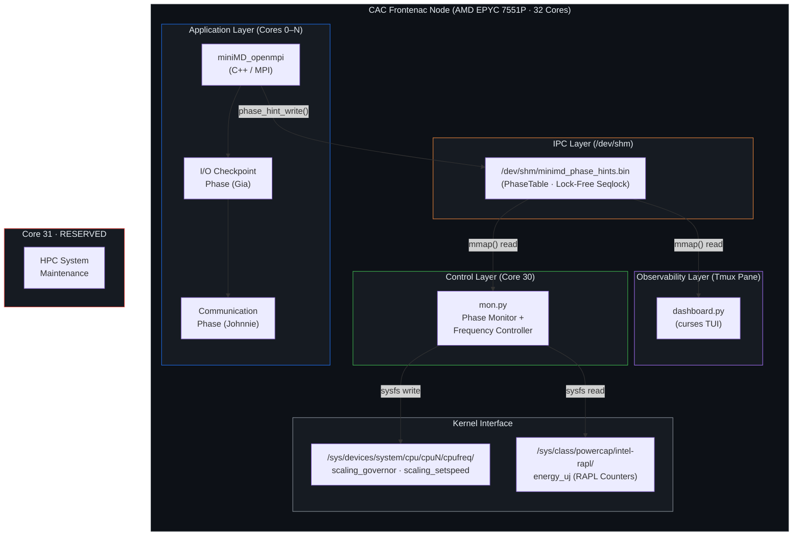
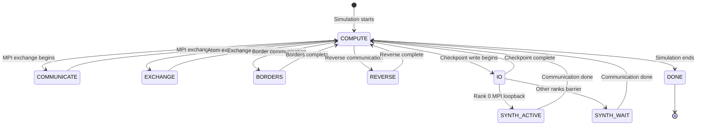

# System Architecture Document

**Project:** miniMD Phase-Aware DVFS Optimization  
**Course:** ELEC 490/498 Capstone - Group 30  
**Authors:** Johnnie Tse, Gia Lee, Zane Prance, Valerie So  
**Supervisor:** Dr. Ryan Grant  
**Platform:** CAC Frontenac HPC Cluster (AMD EPYC 7551P, 32 cores)  

---

## 1. Executive Summary

This system implements a **user-level, phase-aware Dynamic Voltage and Frequency Scaling (DVFS) controller** for the miniMD molecular dynamics proxy application from the Mantevo project. The controller detects application execution phases in real-time through a shared-memory IPC mechanism and dynamically adjusts CPU core frequencies to reduce energy consumption during low-utilization phases (I/O, communication, synchronization waits) while maintaining full performance during compute-intensive phases.

The architecture follows a **three-tier decoupled design**:

1. **Instrumented Application** (C++ / MPI) — Publishes phase hints to POSIX shared memory
2. **Frequency Controller** (Python) — Reads phase hints and actuates CPU `cpufreq` governors
3. **Observability Layer** (Python / curses) — Optional real-time TUI dashboard for live monitoring

---

## 2. Architecture Diagram



---

## 3. Core Layout (32-Core Node)

| Core(s) | Role | Process | Changeable? |
|---------|------|---------|-------------|
| `0 – N` | Worker Cores | MPI ranks (1:1 core binding) | ✅ Frequency controlled |
| `30` | Monitor Core | `mon.py` / `comm_freq_controller.py` | ❌ Pinned to `performance` |
| `31` | Reserved | HPC system maintenance | ❌ No permission to modify |

**Valid Worker Counts:** 1, 2, 4, 8, 16, 26, 30  
- Maximum: 30 cores (core 30 = monitor, core 31 = reserved)  
- Maximum power-of-2: 16 cores  
- Typical demo: 26 cores (`taskset -c 4-29`)

---

## 4. Technology Stack

| Layer | Technology | Version / Details |
|-------|------------|-------------------|
| Application | C++ (miniMD from Mantevo) | Modified `integrate.cpp`, `ljs.cpp` |
| Parallelism | OpenMPI | `mpirun` with `--bind-to core --map-by core` |
| IPC | POSIX Shared Memory | `/dev/shm/minimd_phase_hints.bin` via `mmap()` |
| Controller | Python 3 | `mon.py`, `comm_freq_controller.py` |
| Actuation | Linux cpufreq sysfs | `scaling_governor`, `scaling_setspeed` |
| Telemetry | Intel RAPL | `energy_uj` via `/sys/class/powercap/` |
| Dashboard | Python curses | Terminal User Interface (TUI) |
| Job Scheduler | SLURM | `salloc`, `sbatch` on Frontenac cluster |
| Build System | GNU Make | `make openmpi -j 8` |
| Session Manager | tmux | Multi-pane demo launcher (`launch_demo.sh`) |

---

## 5. Component Interaction Model

### 5.1 Phase Lifecycle State Machine



### 5.2 Execution Timeline

```
┌─────────────┬────────────────────────────┬──────────────────────┬────────────────────────────┬─────────────┐
│  COMPUTE    │        I/O PHASE           │    COMM PHASE        │        COMPUTE             │    DONE     │
│  (Force +   │  (Sustained checkpoint     │  (MPI loopback on    │  (Second half of           │             │
│   Neighbor) │   writes, ~30s target)     │   rank 0, ~30s)      │   simulation loop)         │             │
├─────────────┼────────────────────────────┼──────────────────────┼────────────────────────────┼─────────────┤
│  2.0 GHz    │  1.2 GHz (DVFS active)     │  1.2 GHz (DVFS)      │  2.0 GHz (restored)        │  Cleanup    │
│  performance│  userspace governor        │  userspace governor   │  performance governor      │             │
└─────────────┴────────────────────────────┴──────────────────────┴────────────────────────────┴─────────────┘
```

---

## 6. Design Decisions (Architecture Decision Records)

### ADR-001: Lock-Free Seqlock for Phase Communication
- **Context:** The C++ application must communicate phase state to the Python monitor with <1ms latency
- **Decision:** Use a lock-free sequence-lock protocol via POSIX shared memory (`/dev/shm`)
- **Rationale:** Avoids mutex contention, zero-copy, near-zero overhead. The seqlock pattern ensures readers always get a consistent snapshot without blocking writers
- **Consequences:** Reader must retry on odd sequence numbers; monitor must tolerate stale reads

### ADR-002: Dedicated Monitor Core
- **Context:** The monitor must not compete with application MPI ranks for CPU time
- **Decision:** Pin the monitor to Core 30 using `taskset -c 30`
- **Rationale:** Core 30 is the second-to-last core, leaving Core 31 for HPC system maintenance. This guarantees zero contention between the monitor and the application
- **Consequences:** Reduces available worker cores by 1 (from 31 to 30 max)

### ADR-003: Simple Phase Controller (Test C) over Adaptive Controller (Test C2)
- **Context:** Two controller designs were evaluated — a simple threshold-based controller and an adaptive beta-adaptation controller
- **Decision:** Adopt the simple `comm_freq_controller.py` (Test C) as the production controller
- **Rationale:** Test C2 (`integrated_freq_controller.py`) caused 38–97% execution time regressions due to slow frequency ramp-up after I/O phases. Test C maintains ≤0.4% overhead
- **Consequences:** Simpler code, predictable behavior, modest but reliable energy savings

### ADR-004: Sustained I/O and Communication Phases
- **Context:** Original miniMD has no I/O or communication phases — they needed to be synthesized for research
- **Decision:** Inject sustained I/O (Gia) and MPI loopback communication (Johnnie) phases into the simulation loop
- **Rationale:** Real HPC applications have substantial communication and I/O phases; miniMD alone is nearly purely compute-bound. The synthesis creates a realistic multi-phase workload
- **Consequences:** Phases are configurable via CLI flags (`--comm_phase`, `--comm_standin_mb`, `--ckpt_ioscale_sec`)

### ADR-005: File-Based Phase Markers as Bridge Fallback
- **Context:** The shared-memory protocol requires both C++ and Python to agree on struct layouts
- **Decision:** Provide `bridge_to_dashboard.py` as a fallback that reads text-based `phase_marker.txt` and writes to shared memory
- **Rationale:** Enables the dashboard to work even when the application uses text-based phase signaling
- **Consequences:** Adds latency (~50ms poll) but provides compatibility

---

## 7. Repository Structure Overview

```
ELEC_498_All_directories_and_branches_folder_for_2026_02_15/
├── 00_architecture_docs/    [NEW] Software architecture documentation
├── 02_src/                  Production source code (curated final versions)
│   ├── comm_phase_version/  C++ source with communication phase (Johnnie)
│   ├── mpi_comm_version/    C++ source with MPI comm + shared-memory hints (Zane)
│   ├── controllers/         Python frequency controllers
│   ├── monitoring/          Phase monitoring and dashboard tools
│   └── analysis/            Data analysis and plot generation scripts
├── 03_scripts/              Operational runtime scripts
│   ├── batch_tests/         Parameterized batch test scripts (Tests A–D)
│   ├── cluster_jobs/        SLURM job submission and environment setup
│   └── setup/               Environment setup scripts (placeholder)
├── 04_configs/              Configuration files and simulation inputs
├── 07_archive/              Deprecated prototypes and historical branches
│   ├── johnnie_comm_phase/  Communication phase optimization (primary)
│   ├── johnnie_serial_memory_phase/  Serial/memory phase exploration
│   ├── gia_final/           I/O checkpoint with monitoring
│   ├── gia_scaling_io/      I/O scaling with frequency monitoring
│   ├── zane_mpi_comm/       MPI communication controller (multiple iterations)
│   ├── zane_prototype/      Early prototype (pre-MPI comm)
│   ├── val_testing/         I/O benchmark automation suite
│   └── main_repo/           Original repository placeholder
├── 08_test_gui/             TUI/web/windowed dashboard experiments
├── johnnie-comm-phase/      Active development branch (comm phase source)
├── README.md                Project overview
├── .gitignore               Version control exclusions
├── reorganize_workspace.ps1 7-phase workspace migration script
├── large_files.txt          Registry of files exceeding Git's size limit
└── push_log.txt             Git push operation logs
```

---

## 9. Security and Access Model

| Resource | Access Level | Notes |
|----------|-------------|-------|
| `/dev/shm/minimd_phase_hints.bin` | `0666` (world r/w) | Created by Rank 0, cleaned up on termination via `unlink()` |
| `/sys/devices/system/cpu/cpuN/cpufreq/*` | Root or `cpufreq` group | Requires `sudo` or group membership on Frontenac |
| `/sys/class/powercap/intel-rapl/*/energy_uj` | Readable by default | RAPL energy counters — read-only telemetry |
| Core 31 | System-reserved | HPC scheduler owns this core; **never modify** |
| `cleanup.sh` | Emergency restore | Restores all governors to `performance` — run after crashes |

---

## 10. Performance Characteristics

| Metric | Target | Achieved |
|--------|--------|----------|
| Phase hint write latency | <1ms | ~0.001ms (direct `memcpy` + barrier) |
| Monitor poll interval | 2ms | 2ms (`--poll-ms 2`) |
| Frequency actuation latency | <1ms | <1ms (direct sysfs write) |
| Controller CPU overhead | <5% | 0.04% (0.04ms per 100ms loop) |
| Execution time overhead (Test C) | <3% | ≤0.4% |
| Energy savings (Test C, N=30) | 10–15% | ~2.4% (limited by I/O sleep pattern) |
| RAPL measurement variance | — | 10–20% σ (requires 25+ trials for significance) |

---

## 11. Failure Modes and Recovery

| Failure | Impact | Recovery |
|---------|--------|----------|
| Monitor crashes mid-actuation | Worker cores stuck in `userspace` governor at low frequency | Run `cleanup.sh` to restore all governors to `performance` |
| Shared memory file missing | Monitor waits indefinitely; dashboard shows "Waiting for hint file" | Restart miniMD (Rank 0 creates the file) |
| RAPL counter overflow | Energy values wrap around (16-bit µJ counter) | Correct with modular arithmetic; occurs at ~80 minutes of continuous measurement |
| MPI rank crash | Application exits; shared memory orphaned | `unlink()` called by Rank 0 on normal exit; manual `rm /dev/shm/*.bin` otherwise |
| Tmux session collision | `launch_demo.sh` kills existing `minimd_demo` session | By design — script runs `tmux kill-session` first |

---

## 12. Cross-References

| Document | Coverage |
|----------|----------|
| [02_src_directory.md](02_src_directory.md) | Source code deep-dive, class hierarchy, API reference |
| [03_scripts_directory.md](03_scripts_directory.md) | Batch test scripts and cluster job automation |
| [04_configs_directory.md](04_configs_directory.md) | Configuration files and simulation parameters |
| [07_archive_branches.md](07_archive_branches.md) | All 8 archived development branches |
| [08_test_gui_directory.md](08_test_gui_directory.md) | Dashboard implementations |
| [09_data_flow_and_ipc.md](09_data_flow_and_ipc.md) | Shared-memory protocol specification |
| [10_build_deploy_runbook.md](10_build_deploy_runbook.md) | Build, deploy, and operational procedures |
| [11_root_level_files.md](11_root_level_files.md) | Root-level file documentation |
| [12_glossary_and_references.md](12_glossary_and_references.md) | Terminology and external references |
